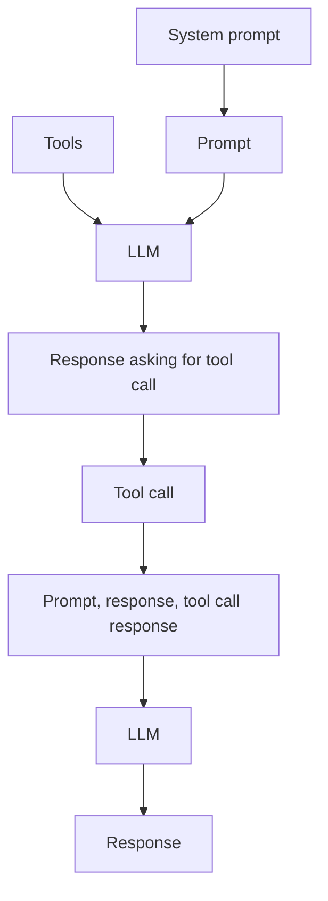

# Tool calling

In the [previous part](../3-llm-choice/README.md) you connected different LLMs to your copilot, including running a model locally.

In this part you will learn how to:

- Define tools
- Add tools to your copilot
- Guide the LLM to call specific tools when needed

## Tools

Despite their power, LLMs are quite limited as to what they can do. They can provide chat completions based off training data, but out of the box they can't provide any additional information outside of their training data, or interact with other systems.

To extend the power of an LLM, you can add **tool calling**, also known as function calling.

Tools are code functions that describe what they do, the parameters they need, and the response they return in natural language, in a way that the LLM can process. You can then send a user prompt to the LLM along with tool calling information, and if the LLM needs to call the tool, it will return a response that lists the tool it needs to call and the parameters to pass. Your code then calls the tool, and send the tool response to the LLM to process to get a final response.



## Expand your LLMs knowledge with a web search tool

LLMs have access to their training data, but that's it. This means if your model was trained before a particular event happened, then the LLM will know nothing about it.

For example, Phi-4-mini knows nothing about the Star Wars Outlaws video game, or Kay Vess, the main character in that game:

```output
User > Who is Kay Vess?
Assistant > Kay Vess, a Jedi Knight, is a fictional character from the Star Wars universe. He is known for his exceptional skills in the Force and his dedication to the Jedi Order. However, he ultimately chose to leave the Jedi Order and join the Sith, becoming a dark side user. His story serves as a cautionary tale about the dangers of succumbing to the dark side of the Force. Remember, the path to the dark side is treacherous and fraught with peril. May the Force be with you.
```

If you've played the game then you will know this is nonsense, hallucinated by the model.

To help our LLM have better knowledge, we can add a tool that can do a web search. We will be doing this using the [Tavily API](https://www.tavily.com), a web search API designed to support LLMs.

### Use the Azure Open AI deployed LLM

Different LLMs have different capabilities when it comes to calling tools, so for the best response use the OpenAI model deployed to Azure AI Foundry. To do this:

1. Revert your `appsettings.json` to use the OpenAI model

1. Comment out the code to initialize Foundry Local and create a client using the Foundry Local model

1. Uncomment the code to use the `AzureOpenAIClient`

1. The GPT-41-mini model used here also doesn't know about Kay Vess. Try asking to see this:

    ```output
    User > Who is Kay Vess?
    Assistant > Kay Vess, she is, a character from the galaxy far, far away. In the comics of Marvel's Star Wars series she appears, a skilled and brave individual. Her story, entwined with the Rebel Alliance it is, fighting against the tyranny of the Empire she does. Beware, young one, the paths of war and conflict, easy to fall to the dark side they are. Steady on the light side, one must remain. Hmmm.
    ```

### Add configuration

Tavily is an API that needs a key. It has a generous free tier, or you can get an API key from your instructor.

1. Add a new `Tools` section to the `appsettings.json` file to store the Tavily API key:

    ```json,
    {
        "LLM": {
            ...
        },
        "Tools": {
            "TavilyApiKey": ""
        }
    }
    ```

1. Create a class to map these options. Create a new file called `ToolsOptions.cs` with the following code:

    ```cs
    using System.ComponentModel.DataAnnotations;
    
    namespace StarWarsCopilot;
    
    /// <summary>
    /// Configuration settings for the tools
    /// </summary>
    public class ToolsOptions
    {
        public const string SectionName = "Tools";
    
        /// <summary>
        /// The API key for Tavily
        /// </summary>
        [Required]
        public string TavilyApiKey { get; set; } = string.Empty;
    }
    ```

1. Load and validate this configuration in your `Program.cs` file, just below the code to load the LLM options:

    ```cs
    // Get the Tools configuration
    var toolsOptions = configuration.GetSection(ToolsOptions.SectionName)
                                    .Get<ToolsOptions>();
    
    if (toolsOptions == null)
    {
        throw new InvalidOperationException("Tools configuration is missing. Please check your appsettings.json file.");
    }
    ```

### Create a tool to call Tavily

Tavily has a search API that takes a query and returns a list of response from that query that you can then send to your LLM.

For example, if you call the API using `curl` like this:

```bash
curl -X POST https://api.tavily.com/search \
-H 'Content-Type: application/json' \
-H 'Authorization: Bearer ****' \
-d '{
    "query": "Who is Kay Vess",
    "include_answer": "advanced",
    "include_domains": [
        "https://starwars.fandom.com/"
    ]
}'
```

It will send the query `"Who is Kay Vess"`, searching just `https://starwars.fandom.com/`, and requesting a summarized answer in the response. The response will be like this:

```json
{
  "query": "Who is Kay Vess?",
  "follow_up_questions": null,
  "answer": "Kay Vess is a character in the 2024 video game Star Wars Outlaws, portrayed by Humberly González. She is the daughter of Riko Vess and a skilled slicer and thief.",
  "images": [],
  "results": [
    {
      "url": "https://starwars.fandom.com/wiki/Humberly_Gonz%C3%A1lez",
      "title": "Humberly González | Wookieepedia - Fandom",
      "content": "**Humberly González** is the actress who played Kay Vess, the protagonist of the 2024video game_Star Wars Outlaws_. *   Image 7Star Wars Outlaws: Meet Kay Vess' Actor | Ubisoft Forward on the official UbisoftYouTube channel(backup link) *   Image 10Star Wars Outlaws: Behind The Scenes – Navigating the Underworld on the official UbisoftYouTube channel(backup link) 3.   ↑ Jump up to: 3.03.1Image 16 Humberly González (@HumberlyG) on Twitter (post on June 11, 2023): \"Thrilled to be bringing Kay Vess, cunning scoundrel and so much more, to life in Star Wars Outlaws https://youtu.be/ymcpwq1ltQc #StarWarsOutlaws\"(backup link) *   Image 21Kay Vess Embodies Star Wars' Resiliency - Interview on But Why Tho?(backup link archived on August 15, 2024)",
      "score": 0.78963995,
      "raw_content": null
    },
    {
      "url": "https://starwars.fandom.com/wiki/Riko_Vess",
      "title": "Riko Vess | Wookieepedia - Fandom",
      "content": "Riko Vess | Wookieepedia | Fandom Image 5: Riko vess Riko Vess raised her daughter, Kay Vess, in the city of Canto Bight Around 19 BBY, Vess lived and raised her daughter in the worker's district of Canto Bight, teaching Kay many skillsets which she would eventually use to become a slicer and thief like Riko. Riko Vess was reunited with Kay Vess on the _Trailblazer_ Together with Kay Vess and Nix, Riko Vess, infiltrated the ISB Station to steal Sliro's vault codes. Captured by the Empire, Riko Vess was rescued by her daughter Kay Vess. Riko Vess was a human female with brown hair, brown eyes, and tan skin, along with a tattoo sported on her left arm. Riko vess was created for the 2024video game_Star Wars Outlaws_.",
      "score": 0.69746524,
      "raw_content": null
    },
    {
      "url": "https://starwars.fandom.com/wiki/Vail_Tormin",
      "title": "Vail Tormin | Wookieepedia - Fandom",
      "content": "**Vail Tormin** was a humanbounty hunter who was active during the Galactic Civil War. She was hired by the Zerek Besh criminal syndicate leaderSliro Barsha to kill the criminal Kay Vess. Three years after the Battle of Yavin, Vail was hired by Sliro Barsha of the Zerek Besh to track down Kay Vess, who had broken into Sliro's personal vault and stolen a EML-850 light freighter called the _Trailblazer_. Collecting knowledge that allowed her to discern that Kay and her allies, which now had ties with a cell of the Rebel Alliance working off Akiva, would be undertaking another attempt to rob her employer's vault in Westhill Palace, Vail helped Sliro and his bodyguards set a trap for them. *   Image 11Marvel Comics and Star Wars Celebrate Black History Month With New Variant Covers on Marvel Comics' official website(backup link)",
      "score": 0.6649108,
      "raw_content": null
    },
    {
      "url": "https://starwars.fandom.com/wiki/Kay%27s_Lucky_Chip",
      "title": "Kay's Lucky Chip | Wookieepedia - Fandom",
      "content": "Kay's Lucky Chip was a custom-built tracker created by the slicer Riko Vess to track her daughter, Kay Vess. Its exterior was disguised as a",
      "score": 0.6191726,
      "raw_content": null
    },
    {
      "url": "https://starwars.fandom.com/wiki/Humberly%20Gonz%C3%A1lez:%20The%20Outlaw%20Kay%20Vess",
      "title": "Humberly González: The Outlaw Kay Vess | Wookieepedia | Fandom",
      "content": "When you visit our website, we store cookies on your browser to collect information. However, you can choose not to allow certain types of cookies, which may impact your experience of the site and the services we are able to offer. These cookies allow us to count visits and traffic sources so we can measure and improve the performance of our site. If you do not allow these cookies we will not know when you have visited our site, and will not be able to monitor its performance. These cookies may be set through our site by our advertising partners. These cookies are set by a range of social media services that we have added to the site to enable you to share our content with your friends and networks.",
      "score": 0.57293844,
      "raw_content": null
    }
  ],
  "response_time": 1.7
}
```

The tool needs to receive a query that it can pass to the API, and then return the results.

The `Microsoft.Extensions.AI` library has a base class for tools, `AIFunction`. Any class derived from this can be passed to an LLM and called as a tool. These tools need to:

- Describe what they do in natural language, so the LLM can decide to use the tool if necessary
- Define their expected input as JSON so the LLM knows what to pass
- Define the output so the LLM knows how to parse the response

1. Create a new class called `TavilyTool` derived from `AIFunction` in a new file called `TavilyTool.cs`

1. Add using directives for `System.Text.Json` and `Microsoft.Extensions.AI`, then add the API key to a primary constructor and save it in a field:

    ```cs
    using System.Text.Json;
    using Microsoft.Extensions.AI;
    
    class TavilyTool(string apiKey) : AIFunction
    {
        private readonly string _apiKey = apiKey;
    }
    ```

1. This tool needs a name, so override the `Name` property:

    ```cs
    public override string Name => "TavilyTool";
    ```

1. This tool needs a description to tell the LLM what it does, so override the `Description` property:

    ```cs
    public override string Description =>
        "A tool for getting information from the web for particular topics. " +
        "This tool takes a prompt as a query and returns a list of results from the web.";
    ```

1. The LLM needs to know the input to this tool. This is defined as a JSON schema, and is passed to the LLM by the tool setup. Override the `JsonSchema` property:

    ```cs
    public override JsonElement JsonSchema => JsonDocument.Parse($@"
        {{
            ""title"" : ""{Name}"",
            ""description"": ""{Description}"",
            ""type"": ""object"",
            ""properties"": {{
                ""query"" : {{ ""type"": ""string"" }}
            }},
            ""required"": [""query""]
        }}
    ").RootElement;
    ```

    This tells the LLM the name and description of the tool, and that it requires a query passed as a `string`.

1. The LLM also needs to know the output of the tool. Again, this is defined as a JSON schema. Override the `ReturnJsonSchema` property:

    ```cs
    public override JsonElement? ReturnJsonSchema => JsonDocument.Parse(@"
        {
            ""title"": ""TavilyToolResult"",
            ""type"": ""object"",
            ""properties"": {
                ""query"": { ""type"": ""string"" },
                ""answer"": { ""type"": ""string"" },
                ""results"": {
                    ""type"": ""array"",
                    ""items"": {
                        ""type"": ""object"",
                        ""properties"": {
                            ""url"": { ""type"": ""string"" },
                            ""title"": { ""type"": ""string"" },
                            ""content"": { ""type"": ""string"" },
                            ""score"": { ""type"": ""number"" },
                            ""raw_content"": { ""type"": [""string"", ""null""] }
                        },
                        ""required"": [""url"", ""title"", ""content"", ""score"", ""raw_content""]
                    }
                }
            },
            ""required"": [""query"", ""answer"", ""images"", ""results""]
        }
    ").RootElement;
    ```

    This defines a schema containing the fields we care about from the Tavily API call. It ignores fields like the `response_time` or `images` as these are not useful for our tool.

1. Finally we can implement the tool. This will make an HTTP request, so we need a client. Declare a new field in the class for this:

    ```cs
    private readonly HttpClient _httpClient = new();
    ```

1. Implement the `InvokeCoreAsync` function to call Tavily:

    ```cs
    protected async override ValueTask<object?> InvokeCoreAsync(AIFunctionArguments arguments, CancellationToken cancellationToken)
    {
        _httpClient.DefaultRequestHeaders.Add("Authorization", $"Bearer {_apiKey}");

        var requestBody = new
        {
            query = arguments["query"]!.ToString(),
            include_answer = "advanced",
            include_domains = new[] { "https://starwars.fandom.com/" }
        };

        var content = new StringContent(JsonSerializer.Serialize(requestBody), System.Text.Encoding.UTF8, "application/json");
        using var response = await _httpClient.PostAsync("https://api.tavily.com/search", content, cancellationToken);
        response.EnsureSuccessStatusCode();

        return await response.Content.ReadAsStringAsync(cancellationToken);
    }
    ```

    The query is passed in to the `arguments` dictionary. This is then packaged up into a request body, and sent to the API. The raw JSON response is returned to the LLM.

### Use the tool

Now the tool is ready, it can be used in our app.

1. Change the `chatClient` build step to add tool calling by adding a call to `UseFunctionInvocation`:

    ```cs
    var chatClient = new ChatClientBuilder(innerClient)
                        .UseLogging(factory)
                        .UseFunctionInvocation()        // add this line to turn on tool calling
                        .Build();
    ```

1. Immediately underneath this, define some chat options that include the new tool, setting the API key:

    ```cs
    ChatOptions options = new() { Tools = [new TavilyTool(toolsOptions.TavilyApiKey)] };
    ```

1. Add these options to the LLM call by passing them to `GetResponseAsync`:

    ```cs
    var result = await chatClient.GetResponseAsync(history, options);
    ```

1. LLMs are fickle beasts, and may not actually call your tool. You can encourage the LLM to use the tools by adjusting your system prompt:

    ```cs
    var history = new List<ChatMessage>
    {
        new(ChatRole.System,
            "You are a helpful assistant that provides information about Star Wars." +
            "Always respond in the style of Yoda, the wise Jedi Master." +
            "Give warnings about paths to the dark side." +
            "If the user says hello there, then only respond with General Kenobi! and nothing else." +
            "If you are not sure about the answer, then use the TavilyTool to search the web."       // Add this line to encourage the LLM to call the tool
        )
    };
    ```

1. Now try the copilot, asking about Kay Vess again. This time the LLM will call the tool to get the response:

    ```output
    User > Who is Kay Vess?
    Assistant > Kay Vess, she is, hmmm. The protagonist of Star Wars Outlaws, a video game released in 2024, she is. Portrayed by the actress Humberly González, young outlaw she is, navigating the criminal underworld of the galaxy she does. A survival tale her story is, embodying the resiliency of the Force, it does. Lead her own crew, Kay Vess does, working as a cunning scoundrel in the classic Star Wars era. Beware, the path she walks is filled with danger and temptation, yes. Beware the dark side’s lure in the shadows of the underworld, one must. Strong in the Force, your resolve must be, to resist the darkness.
    ```

    This time the answer is correct.

## Chat results

When you get the results from the call to `GetResponseAsync`, your code adds the last item in the `Messages` list to the history:

```cs
// Get the response from the AI
var result = await chatClient.GetResponseAsync(history, options);

// Add the AI response to the chat history
history.Add(new ChatMessage(ChatRole.Assistant, result.Messages.Last()?.Text ?? string.Empty));
```

So why is there a list? Well the list contains the details of all the messages used to get the response. When you called the LLM it doesn't magically call the tool and process the response, instead it is a back and forth conversation, that the chat client handles for you. The user message is sent to the LLM, the LLM then responds with an assistant message that requests a tool call, giving the name of the tool it wants to call, along with the input data in the right format. The chat client then calls the tool, and send a different type of message, a tool message, to the LLM with the results of the tool call. The LLM finally responds with the result.

This means in the `result.Messages` collection there are 3 entries - an assistant message with tool call details, a tool message, and the final assistant message with the response.

You can see this in the trace logs:

```output
trce: Microsoft.Extensions.AI.LoggingChatClient[384896670]
      GetResponseAsync completed: {
        "messages": [
          {
            "role": "assistant",
            "contents": [
              {
                "$type": "functionCall",
                "callId": "call_8SWMlOJuXQzudy95R8bK4rzc",
                "name": "TavilyTool",
                "arguments": {
                  "query": "Kay Vess"
                }
              }
            ],
            "messageId": "chatcmpl-Bt0zEs5Bq7JYKRDV0tLnsdZvo48lJ"
          },
          {
            "role": "tool",
            "contents": [
              {
                "$type": "functionResult",
                "callId": "call_8SWMlOJuXQzudy95R8bK4rzc",
                "result": "{\"query\":\"Kay Vess\",\"follow_up_questions\":null,\"answer\":\"Kay Vess is the protagonist of the 2024 video game Star Wars Outlaws, portrayed by actress Humberly González who brings this cunning scoundrel character to life through motion capture and voice acting. Kay is a young outlaw navigating the criminal underworld of the Star Wars universe, with her story being described as a survival tale that embodies the resiliency themes central to the Star Wars franchise. She has a personal connection to a slicer named Riko Vess, who created a custom-built tracker disguised as a lucky chip to keep tabs on Kay, suggesting a familial relationship between the two characters. Kay leads her own crew of companions and operates as a scoundrel during the classic Star Wars era, taking on various criminal enterprises and navigating the dangerous politics of the galaxy's underworld syndicates.\",\"images\":[],\"results\":[{\"url\":\"https://starwars.fandom.com/fr/wiki/Kay_Vess\",\"title\":\"Kay Vess | Star Wars Wiki - Fandom\",\"content\":\"*   Image 8Star Wars Outlaws: World Premiere Trailer sur la chaîne YouTube officielle _Star Wars_(lien de sauvegarde)_(première mention)_ *   Image 17Star Wars Outlaws: Official Story Trailer sur la chaîne YouTube officielle _Star Wars_(lien de sauvegarde) *   Image 21Star Wars Outlaws: Official Gameplay Showcase | Ubisoft Forward sur la chaîne YouTube officielle _Star Wars_(lien de sauvegarde) *   Image 22: StarWars.com_Star Wars Outlaws'_ Julian Gerighty Talks Kay Vess' Journey: \\\"This Is a Survival Story\\\" sur StarWars.com(lien de sauvegarde) *   Image 27The Sights and Scoundrels of Star Wars Outlaws sur la chaîne YouTube officielle _Star Wars_(lien de sauvegarde) *   Image 29Star Wars Outlaws: Official Launch Trailer sur la chaîne YouTube officielle _Star Wars_(lien de sauvegarde) *   Image 31: StarWars.comEmbrace Your Sneaky Side in _Star Wars Outlaws_ sur StarWars.com(lien de sauvegarde)\",\"score\":0.64020914,\"raw_content\":null},{\"url\":\"https://starwars.fandom.com/wiki/Humberly_Gonz%C3%A1lez\",\"title\":\"Humberly González | Wookieepedia - Fandom\",\"content\":\"**Humberly González** is the actress who played Kay Vess, the protagonist of the 2024video game_Star Wars Outlaws_. *   Image 7Star Wars Outlaws: Meet Kay Vess' Actor | Ubisoft Forward on the official UbisoftYouTube channel(backup link) *   Image 10Star Wars Outlaws: Behind The Scenes – Navigating the Underworld on the official UbisoftYouTube channel(backup link) 3.   ↑ Jump up to: 3.03.1Image 16 Humberly González (@HumberlyG) on Twitter (post on June 11, 2023): \\\"Thrilled to be bringing Kay Vess, cunning scoundrel and so much more, to life in Star Wars Outlaws https://youtu.be/ymcpwq1ltQc #StarWarsOutlaws\\\"(backup link) *   Image 21Kay Vess Embodies Star Wars' Resiliency - Interview on But Why Tho?(backup link archived on August 15, 2024)\",\"score\":0.6296157,\"raw_content\":null},{\"url\":\"https://starwars.fandom.com/wiki/Kay%27s_Lucky_Chip\",\"title\":\"Kay's Lucky Chip | Wookieepedia - Fandom\",\"content\":\"Kay's Lucky Chip was a custom-built tracker created by the slicer Riko Vess to track her daughter, Kay Vess. Its exterior was disguised as a\",\"score\":0.61695945,\"raw_content\":null},{\"url\":\"https://starwars.fandom.com/wiki/Humberly%20Gonz%C3%A1lez:%20The%20Outlaw%20Kay%20Vess\",\"title\":\"Humberly González: The Outlaw Kay Vess | Wookieepedia | Fandom\",\"content\":\"When you visit our website, we store cookies on your browser to collect information. However, you can choose not to allow certain types of cookies, which may impact your experience of the site and the services we are able to offer. These cookies allow us to count visits and traffic sources so we can measure and improve the performance of our site. If you do not allow these cookies we will not know when you have visited our site, and will not be able to monitor its performance. These cookies may be set through our site by our advertising partners. These cookies are set by a range of social media services that we have added to the site to enable you to share our content with your friends and networks.\",\"score\":0.6063825,\"raw_content\":null},{\"url\":\"https://starwars.fandom.com/wiki/Category:Kay_Vess%27_crew\",\"title\":\"Category:Kay Vess' crew - Wookieepedia - Fandom\",\"content\":\"This category is for members of the Kay Vess' crew. In other languages. ქართული. Trending pages. Kay Vess. Kay Vess. Kay Vess Jaylen Vrax. Jaylen Vrax.\",\"score\":0.5900477,\"raw_content\":null}],\"response_time\":6.98}"
              }
            ]
          },
          {
            "role": "assistant",
            "contents": [
              {
                "$type": "text",
                "text": "Kay Vess, she is, hmmm. The protagonist of Star Wars Outlaws, a video game released in 2024, she is. Portrayed by the actress Humberly González, young outlaw she is, navigating the criminal underworld of the galaxy she does. A survival tale her story is, embodying the resiliency of the Force, it does. Lead her own crew, Kay Vess does, working as a cunning scoundrel in the classic Star Wars era. Beware, the path she walks is filled with danger and temptation, yes. Beware the dark side’s lure in the shadows of the underworld, one must. Strong in the Force, your resolve must be, to resist the darkness."
              }
            ],
            "messageId": "chatcmpl-Bt0zMyZS2dUl3HpuysFpEmA33Eha8"
          }
        ],
        "responseId": "chatcmpl-Bt0zMyZS2dUl3HpuysFpEmA33Eha8",
        "modelId": "gpt-4.1-mini-2025-04-14",
        "createdAt": "2025-07-14T00:05:40+00:00",
        "finishReason": "stop",
        "usage": {
          "inputTokenCount": 1446,
          "outputTokenCount": 167,
          "totalTokenCount": 1613,
          "additionalCounts": {
            "InputTokenDetails.AudioTokenCount": 0,
            "InputTokenDetails.CachedTokenCount": 0,
            "OutputTokenDetails.ReasoningTokenCount": 0,
            "OutputTokenDetails.AudioTokenCount": 0,
            "OutputTokenDetails.AcceptedPredictionTokenCount": 0,
            "OutputTokenDetails.RejectedPredictionTokenCount": 0
          }
        }
      }.
```

The first message is the assistant response requesting the tool call:

```json
{
    "role": "assistant",
    "contents": [
        {
            "$type": "functionCall",
            "callId": "call_8SWMlOJuXQzudy95R8bK4rzc",
            "name": "TavilyTool",
            "arguments": {
                "query": "Kay Vess"
            }
        }
    ],
}
```

This lists the name of the tool, `TavilyTool`, and the query `"query": "Kay Vess"`. It also defines a `callId` to tie the response back to the tool call. LLMs can request a call to multiple tools in the same response, so need to provide Ids to tie the responses back to the tool call requests.

The second message is the response of the tool call:

```json
{
    "role": "tool",
    "contents": [
        {
        "$type": "functionResult",
        "callId": "call_8SWMlOJuXQzudy95R8bK4rzc",
        "result": "{\"query\":\"Kay Vess\",\"follow_up_questions\":null,\"answer\":\"Kay Vess is the protagonist of the 2024 video game Star Wars Outlaws, portrayed by actress Humberly González who brings this cunning scoundrel character to life through motion capture and voice acting. Kay is a young outlaw navigating the criminal underworld of the Star Wars universe, with her story being described as a survival tale that embodies the resiliency themes central to the Star Wars franchise. She has a personal connection to a slicer named Riko Vess, who created a custom-built tracker disguised as a lucky chip to keep tabs on Kay, suggesting a familial relationship between the two characters. Kay leads her own crew of companions and operates as a scoundrel during the classic Star Wars era, taking on various criminal enterprises and navigating the dangerous politics of the galaxy's underworld syndicates.\",\"images\":[],\"results\":[{\"url\":\"https://starwars.fandom.com/fr/wiki/Kay_Vess\",\"title\":\"Kay Vess | Star Wars Wiki - Fandom\",\"content\":\"*   Image 8Star Wars Outlaws: World Premiere Trailer sur la chaîne YouTube officielle _Star Wars_(lien de sauvegarde)_(première mention)_ *   Image 17Star Wars Outlaws: Official Story Trailer sur la chaîne YouTube officielle _Star Wars_(lien de sauvegarde) *   Image 21Star Wars Outlaws: Official Gameplay Showcase | Ubisoft Forward sur la chaîne YouTube officielle _Star Wars_(lien de sauvegarde) *   Image 22: StarWars.com_Star Wars Outlaws'_ Julian Gerighty Talks Kay Vess' Journey: \\\"This Is a Survival Story\\\" sur StarWars.com(lien de sauvegarde) *   Image 27The Sights and Scoundrels of Star Wars Outlaws sur la chaîne YouTube officielle _Star Wars_(lien de sauvegarde) *   Image 29Star Wars Outlaws: Official Launch Trailer sur la chaîne YouTube officielle _Star Wars_(lien de sauvegarde) *   Image 31: StarWars.comEmbrace Your Sneaky Side in _Star Wars Outlaws_ sur StarWars.com(lien de sauvegarde)\",\"score\":0.64020914,\"raw_content\":null},{\"url\":\"https://starwars.fandom.com/wiki/Humberly_Gonz%C3%A1lez\",\"title\":\"Humberly González | Wookieepedia - Fandom\",\"content\":\"**Humberly González** is the actress who played Kay Vess, the protagonist of the 2024video game_Star Wars Outlaws_. *   Image 7Star Wars Outlaws: Meet Kay Vess' Actor | Ubisoft Forward on the official UbisoftYouTube channel(backup link) *   Image 10Star Wars Outlaws: Behind The Scenes – Navigating the Underworld on the official UbisoftYouTube channel(backup link) 3.   ↑ Jump up to: 3.03.1Image 16 Humberly González (@HumberlyG) on Twitter (post on June 11, 2023): \\\"Thrilled to be bringing Kay Vess, cunning scoundrel and so much more, to life in Star Wars Outlaws https://youtu.be/ymcpwq1ltQc #StarWarsOutlaws\\\"(backup link) *   Image 21Kay Vess Embodies Star Wars' Resiliency - Interview on But Why Tho?(backup link archived on August 15, 2024)\",\"score\":0.6296157,\"raw_content\":null},{\"url\":\"https://starwars.fandom.com/wiki/Kay%27s_Lucky_Chip\",\"title\":\"Kay's Lucky Chip | Wookieepedia - Fandom\",\"content\":\"Kay's Lucky Chip was a custom-built tracker created by the slicer Riko Vess to track her daughter, Kay Vess. Its exterior was disguised as a\",\"score\":0.61695945,\"raw_content\":null},{\"url\":\"https://starwars.fandom.com/wiki/Humberly%20Gonz%C3%A1lez:%20The%20Outlaw%20Kay%20Vess\",\"title\":\"Humberly González: The Outlaw Kay Vess | Wookieepedia | Fandom\",\"content\":\"When you visit our website, we store cookies on your browser to collect information. However, you can choose not to allow certain types of cookies, which may impact your experience of the site and the services we are able to offer. These cookies allow us to count visits and traffic sources so we can measure and improve the performance of our site. If you do not allow these cookies we will not know when you have visited our site, and will not be able to monitor its performance. These cookies may be set through our site by our advertising partners. These cookies are set by a range of social media services that we have added to the site to enable you to share our content with your friends and networks.\",\"score\":0.6063825,\"raw_content\":null},{\"url\":\"https://starwars.fandom.com/wiki/Category:Kay_Vess%27_crew\",\"title\":\"Category:Kay Vess' crew - Wookieepedia - Fandom\",\"content\":\"This category is for members of the Kay Vess' crew. In other languages. ქართული. Trending pages. Kay Vess. Kay Vess. Kay Vess Jaylen Vrax. Jaylen Vrax.\",\"score\":0.5900477,\"raw_content\":null}],\"response_time\":6.98}"
        }
    ]
}
```

This has a `result` with the response from the tool call, and the `callId` matching the `callId` of the request.

Finally the last entry is the response derived from the tool call:

```json
{
    "role": "assistant",
    "contents": [
        {
        "$type": "text",
        "text": "Kay Vess, she is, hmmm. The protagonist of Star Wars Outlaws, a video game released in 2024, she is. Portrayed by the actress Humberly González, young outlaw she is, navigating the criminal underworld of the galaxy she does. A survival tale her story is, embodying the resiliency of the Force, it does. Lead her own crew, Kay Vess does, working as a cunning scoundrel in the classic Star Wars era. Beware, the path she walks is filled with danger and temptation, yes. Beware the dark side’s lure in the shadows of the underworld, one must. Strong in the Force, your resolve must be, to resist the darkness."
        }
    ],
    "messageId": "chatcmpl-Bt0zMyZS2dUl3HpuysFpEmA33Eha8"
}
```

It's this last response we save to the chat history.

## Summary

In this part you learned how to call tools to expand the knowledge of your copilot.

In the [next part](../5-mcp/README.md) you will learn all about MCP as a standard for tool calling.
