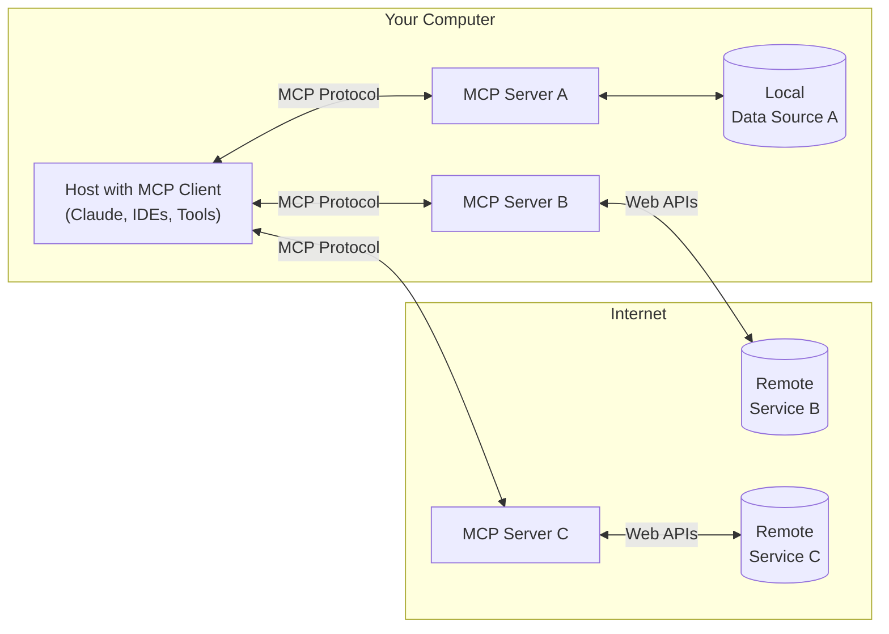
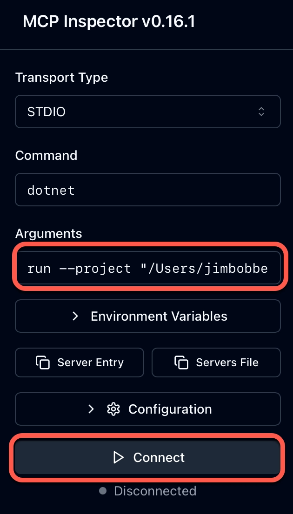
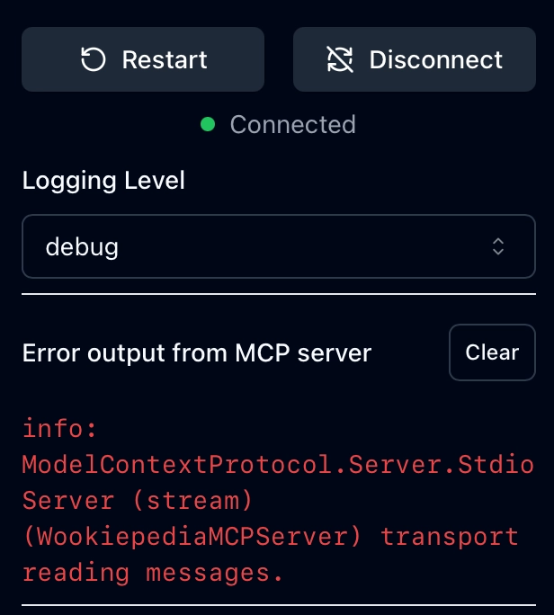
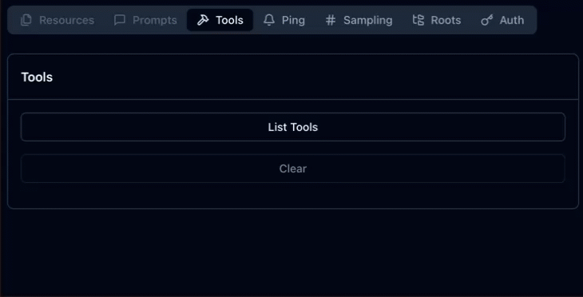
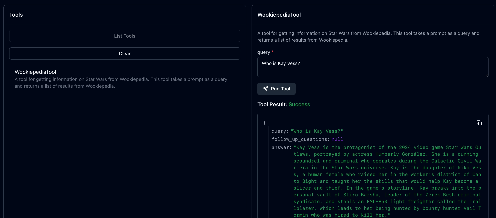

# MCP - Model Context Protocol

In the [previous lesson](../4-call-tools/README.md) you learned how to call tools to expand the knowledge of your copilot.

In this you will learn:

- What is MCP
- How MCP standardizes tool calling
- How to use MCP from your copilot

## What is MCP?

In the previous lesson you defined a tool using code that the LLM could call. You were writing code to wrap an API in the format needed by `Microsoft.Extensions.AI` so that the LLM could call the tool. If we want to add more tools, we have to keep writing code to wrap different APIs or to call different services.

This becomes a lot of work if we have a lot of tools. Different LLMs also have different ways to call tools. If we have to write code for each tool, then it becomes hard to register new tools at run time.

[**MCP**, or **Model Context Protocol**](https://modelcontextprotocol.io/introduction) is designed to solve this - it is a protocol to define an external server that has tools, that you can either call by running a separate process and interacting over stdio, or by calling a well-defined streaming HTTP API. This way you once you have the ability to call MCP tools in your app, you can add new tools at run time, deploy new versions of tools without changing your app, and interact with off-the-shelf tools.

MCP has 3 parts - servers, a client, and a host.

- A **Server** is an application that provides tools. This can run locally, or be accessed over a network connection, running on your network, or in the cloud. It can provide a list of the tools available, provide access to each tool, and send updates when tools change.
- The **client** is a component of AI app. This registers one or more servers that it can call into.
- The **host** is the application that the client runs in.



[source](https://modelcontextprotocol.io/introduction#general-architecture)

MCP was invented by Anthropic, the makers of Claude, in November 2024. As an open standard it's had a huge amount of traction, and has fast become the default protocol for how AI apps talk to external tools. There are now literally hundreds if not thousands of off-the-shelf MCP servers you can call from your AI apps, with apps like Claude Desktop, GitHub Copilot, and Cursor supporting MCP.

MCP servers can contain multiple tools. Just like tools defined in your app in code, these tools have a natural language description for what they do, as well as a defined schema for the inputs they accept and the output they return. These inputs and outputs are again defined as a JSON schema.

The power here is reusability - you can create an MCP server and call it from any MCP client, there's no need to build multiple versions of your tool in every application, or to conform to different LLM SDKs.

> You may have heard of GitHub copilot extensions - this was a similar idea to standardize tools, but you could only use GitHub Copilot extensions from inside GitHub copilot. MCP allows you to call tools from any MCP client, including GitHub copilot.

## Build an MCP server

Our web search tool is working well for us, but would be better if we could move it out to an MCP server, then change our copilot to be an MCP client so we can add more MCP servers.

MCP is designed to work with external tools, not functions inside your app. The advantage of moving tools out to an MCP server is it breaks down your app into components that can be reused, or updated independently. Instead of having one app with built in tools, you can deploy a smaller app along with tools as separate MCP servers - kind of like deploying these servers as different microservices.

Lets build a Star Wars MCP server, with one tool for querying Wookiepedia.

There is an official C# MCP SDK supported by Microsoft that allows you to create MCP servers and clients in only a few lines of code.

### Create the project

1. Create a new folder called `StarWarsMCPServer` and open it in your IDE.

1. Create a new .NET console project.

    ```bash
    dotnet new console
    ```

1. Add NuGet packages to read configuration, and the C# MCP SDK:

    ```bash
    dotnet add package Microsoft.Extensions.Hosting --version 10.0.1
    dotnet add package ModelContextProtocol --version 0.5.0-preview.1
    ```

1. Initialize the .NET secrets manager

    ```bash
    dotnet user-secrets init
    ```

1. Add a new user secret for the Tavily API key:

    ```bash
    dotnet user-secrets set "Tavily:ApiKey" "..."
    ```

1. Copy `ToolsOptions.cs` file from your Star Wars Copilot project into this folder - we can re-use this class to load the Tavily API key.

1. Change the namespace in the `ToolsOptions.cs` file to match the new project:

    ```cs
    namespace StarWarsMCPServer;
    ```

### Set up the MCP server

There are 2 ways for an MCP client to communicate with an MCP server - stdio or streamable HTTP.

- Stdio servers are processes that are launched by the MCP client, and they communicate over stdio - so over standard input and output, essentially sending and receiving JSON via the same protocol as `Console.ReadLine` and `Console.WriteLine`.
- Streamable HTTP servers are servers that are already running, and you stream data in and out over HTTP.

Stdio is great for launching processes locally, and is generally the easiest. Streaming HTTP is used for persistent servers, such as those running over the internet.

We are going to use stdio as it is easiest.

1. In the `StarWarsMCPServer`, replace the code in `Program.cs` with the following:

    ```cs
    using Microsoft.Extensions.DependencyInjection;
    using Microsoft.Extensions.Hosting;
    using Microsoft.Extensions.Logging;
    
    var builder = Host.CreateApplicationBuilder(args);
    builder.Logging.AddConsole(consoleLogOptions =>
    {
        // Configure all logs to go to stderr
        consoleLogOptions.LogToStandardErrorThreshold = LogLevel.Trace;
    });
    
    builder.Services
        .AddMcpServer()
        .WithStdioServerTransport()
        .WithToolsFromAssembly();
    
    await builder.Build().RunAsync();
    ```

    This is the core of your MCP server - it creates an application builder with console logging, logging everything trace and above to stderr.

    The reason it uses stderr for everything is that you can't log anything to stdout as you would normally do. Stdout is used to get responses from the MCP server, so anything that is not a response to a call to the MCP server has to be sent to stderr, otherwise the MCP client will fail to understand it and throw errors.

    It then adds 3 MCP services:

    - An MCP Server, so the core functionality to run an MCP server
    - Stdio server transport, providing access to the MCP server using stdio
    - Tools from the assembly, so the builder scans the assembly and looks for tools, then exposes these automatically.

    Once the builder has been created, the application is built and is run asynchronously. This starts the server and it stays running, listening on stdin for requests from an MCO client.

### Add an MCP tool

We have our server, now we need to add a new tool.

1. Add a new file called `StarWarsTools.cs` containing a static class called `StarWarsTools` that has the `McpServerToolType` attribute:

    ```cs
    using System.ComponentModel;
    using System.Text.Json;
    
    using ModelContextProtocol.Server;

    namespace StarWarsMCPServer;
    
    [McpServerToolType]
    public static class StarWarsTools
    {
    }
    ```

    The `McpServerToolType` tells the MCP server that this class contains tools it can use. This is scanned by the `WithToolsFromAssembly` call on the `builder`.

1. Add fields for an HTTP client, and a static constructor to load the options for the tool to get the API key. This loads the configuration, then sets the Tavily API key as a header on the HTTP client:

    ```cs
    private readonly static HttpClient _httpClient = new();

    static StarWarsTools()
    {
        _httpClient.DefaultRequestHeaders.Add("Authorization", $"Bearer {ToolsOptions.TavilyApiKey}");
    }
    ```

1. Add a function for the Wookiepedia tool, decorated with the `MCPServerTool` attribute:

    ```cs
    [McpServerTool(Name = "WookiepediaTool"),
     Description("A tool for getting information on Star Wars from Wookiepedia. " +
                 "This tool takes a prompt as a query and returns a list of results from Wookiepedia.")]
    public static async Task<string> QueryTheWeb([Description("The query to search for information on Wookiepedia.")] string query)
    {
        var requestBody = new
        {
            query,
            include_answer = "advanced",
            include_domains = new[] { "https://starwars.fandom.com/" }
        };

        var content = new StringContent(JsonSerializer.Serialize(requestBody), System.Text.Encoding.UTF8, "application/json");
        using var response = await _httpClient.PostAsync("https://api.tavily.com/search", content);
        response.EnsureSuccessStatusCode();

        return await response.Content.ReadAsStringAsync();
    }
    ```

    This function is decorated with 2 attributes:

    - `McpServerTool` - this tells the MCP server that this function is a tool. The `Name` property defines the name of the tool.
    - `Description` - this is the `System.ComponentModel.Description` attribute that is used in a lot of situations. Here is defines the tool description. This description is the same description that you used for the tool in your code earlier.

    The `query` parameter is exposed to the MCP client, so that it knows it needs to pass a query to this call. This is also decorated with the same `Description` attribute to describe the parameter as before.

What's nice here is that you don't need to define the JSON schema for the input and output, like you had to when you defined the tool in code in your copilot. The `Description` attribute on the tool and parameter define the input, and the LLM expects a string output that it will parse.

### Test your MCP server

This is all the code you need for the MCP server, so let's test it using the MCP inspector. The MCP inspector is a tool from Anthropic that allows you to connect to MCP servers, inspect them, and call the tools.

1. Run the following command to run the inspector:

    ```bash
    npx @modelcontextprotocol/inspector dotnet run --project <path>/StarWarsMCPServer.csproj
    ```

    Replace `<path>` with the path of your project. The first time you run this command, you will need to select `y` to proceed with installing the inspector Node package.

    This will start the inspector and configure it to connect to your project. The inspector will then load in your default browser.

1. Select the **Connect** button. This will run your project using the command you provided when you launched it (`dotnet run --project <path>/StarWarsMCPServer.csproj`), then connect over stdio. This is one of the big advantages of using stdio transport, you don't have to host an API anywhere, the MCP client can launch a local process, including running a project with the dotnet cli, and connect to it.

    

    The server will show as connected:

    

    You may see the logs from the MCP server in the _Error output from the MCP Server_ section. Don't worry about these, they are not errors, just info logs, but we have to use stderr for any logging.

1. Ensure **Tools** is selected in the top menu, then select the **List Tools** button to see the tools:

    

1. Once the tools are listed, you can test out the _WookiepediaTool_. Select it, and the tool details will show on the pane next to the tools list, showing the description, as well as an input box for the `query`. Enter a query, such as "Who is Kay Vess?" and select **Run Tool**.

    

You can now use this MCP server in any tool that is an MCP client. If you are using GitHub copilot, or Claude, you can add this as an MCP server and ask Star Wars questions!

## Add an MCP client to your copilot

Now we have our server, we can call it from our copilot by adding an MCP client to the app.

1. Open your `StarWarsCopilot` project.

1. Add the MCP SDK to this project:

    ```cs
    dotnet add package ModelContextProtocol --version 0.5.0-preview.1
    ```

1. Comment out or delete the `WookiepediaTool` and `ToolsOptions` - you won't need this anymore as we are using the MCP server.

### Add configuration for the tool

1. Create a class to store configuration for the MCP server. For this app, we will hard code these options. Create a new file called `MCPServerOptions.cs` with the following code:

    ```cs
    namespace StarWarsCopilot;

    public static class MCPServerOptions
    {
        public static string Name => "StarWarsMCPServer";
        public static string Command => "dotnet";
        public static List<string> Arguments => [
            "run",
            "--project",
            "<path>/StarWarsMCPServer.csproj"
        ];
    }
    ```

    Replace `<path>` with the path to your MCP server project.

### Create the MCP client

1. At the top of the `Program.cs` file, add the following using directive:

    ```cs
    using ModelContextProtocol.Client;
    ```

1. Right before the `chatOptions` are defined, create an MCP client using the hard coded options:

    ```cs
    var clientTransport = new StdioClientTransport(new()
    {
        Name = MCPServerOptions.Name,
        Command = MCPServerOptions.Command,
        Arguments = MCPServerOptions.Arguments,
    }, loggerFactory: factory);
    
    await using var mcpClient = await McpClient.CreateAsync(clientTransport,
                                                            loggerFactory: factory);
    ```

    This code creates a client transport over stdio with the command and arguments defined in your app settings, and uses this to create an MCP client. It also passes our logger factor to the create call to log the MCP interactions

1. After this, load the tools from the MCP client and set these on the chat options. These tools are loaded in a compatible way for the chat options, so can be added to an array and passed to the options.

    ```cs
    var tools = await mcpClient.ListToolsAsync();
    ChatOptions options = new() { Tools = [..tools] };
    ```

### Run the copilot

1. Your copilot is now an MCP client! Run the copilot and ask about Kay Vess again:

    ```bash
    ➜ dotnet run                                          
    User > Who is Kay Vess?
    Assistant > Kay Vess, a young human female thief and criminal she is, hmmm. During the Galactic Civil War era, she operates. From the Worker's District in Canto Bight on Cantonica, she hails. Known by the alias Toren Valario Nupp she is. Leads her own criminal crew, she does, and pilots a prototype EML 850 light freighter called the Trailblazer. Through various heists and operations, she carries out her plans. The protagonist of the 2024 video game Star Wars Outlaws, Kay Vess is. Portrayed by the actress Humberly González, she is.
    ```

1. In the logs you will see the MCP client calling the MCP server:

    ```output
    trce: ModelContextProtocol.Client.McpClient[654635990]
          StarWarsMCPServer sending method 'initialize' request. Request: '{"method":"initialize","params":{"protocolVersion":"2025-06-18","capabilities":{},"clientInfo":{"name":"StarWarsCopilot","version":"1.0.0.0"}},"id":1,"jsonrpc":"2.0"}'.
    dbug: ModelContextProtocol.Client.McpClient[2125972309]
          StarWarsMCPServer waiting for response to request '1' for method 'initialize'.
    dbug: ModelContextProtocol.Client.McpClient[330297028]
          StarWarsMCPServer read JsonRpcResponse message from channel.
    trce: ModelContextProtocol.Client.McpClient[1370997154]
          StarWarsMCPServer Request response received for method initialize. Response: '{"protocolVersion":"2025-06-18","capabilities":{"logging":{},"tools":{"listChanged":true}},"serverInfo":{"name":"StarWarsMCPServer","version":"1.0.0.0"}}'.
    info: ModelContextProtocol.Client.McpClient[1434756563]
          StarWarsMCPServer client received server '{"name":"StarWarsMCPServer","version":"1.0.0.0"}' capabilities: '{"logging":{},"tools":{"listChanged":true}}'.
    trce: ModelContextProtocol.Client.McpClient[1672174748]
          StarWarsMCPServer sending message. Message: '{"method":"notifications/initialized","params":{},"jsonrpc":"2.0"}'.
    info: ModelContextProtocol.Client.McpClientFactory[1458305598]
          StarWarsMCPServer client created and connected.
    trce: ModelContextProtocol.Client.McpClient[654635990]
          StarWarsMCPServer sending method 'tools/list' request. Request: '{"method":"tools/list","params":{},"id":2,"jsonrpc":"2.0"}'.
    dbug: ModelContextProtocol.Client.McpClient[2125972309]
          StarWarsMCPServer waiting for response to request '2' for method 'tools/list'.
    dbug: ModelContextProtocol.Client.McpClient[330297028]
          StarWarsMCPServer read JsonRpcResponse message from channel.
    trce: ModelContextProtocol.Client.McpClient[1370997154]
          StarWarsMCPServer Request response received for method tools/list. Response: '{"tools":[{"name":"WookiepediaTool","description":"A tool for getting information on Star Wars from Wookiepedia. This tool takes a prompt as a query and returns a list of results from Wookiepedia.","inputSchema":{"type":"object","properties":{"query":{"description":"The query to search for information on Wookiepedia.","type":"string"}},"required":["query"]}}]}'.
    ```

    This is initializing the connection to the tool, then listing the tools, the same as you did manually from the MCP inspector.

## Summary

In this lesson you learned all about MCP as a standard for tool calling and reusable tools, and convert your Wookiepedia tool to an MCP server.

In the [next lesson](../6-rag/README.md), you will learn about Retrieval-Augmented generation (RAG) for retrieving information for the LLM to use.
