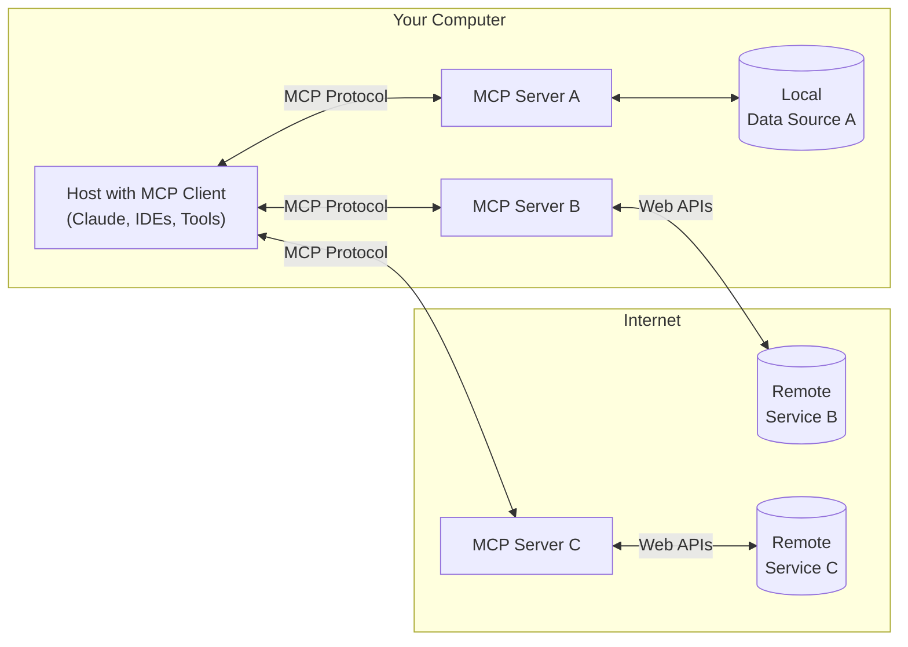

# MCP - Model Context Protocol

In the [previous part](../4-call-tools/README.md) you learned how to call tools to expand the knowledge of your copilot.

In this you will learn:

- What is MCP
- How MCP standardizes tool calling
- How to use MCP from your copilot

## What is MCP?

In the previous part you defined a tool using code that the LLM could call. You were writing code to wrap an API in the format needed by `Microsoft.Extensions.AI` so that the LLM could call the tool. If we want to add more tools, we have to keep writing code to wrap different APIs or to call different services.

This becomes a lot of work if we have a lot of tools. There's also different ways to call tools for different LLMs. If we have to write code, then it becomes hard to register new tools at run time.

[**MCP**, or **Model Context Protocol**](https://modelcontextprotocol.io/introduction) is designed to solve this - it is a protocol to define a tool you can either call by running a separate process, or by calling a well-defined API. This way you once you have the ability to call MCP tools in your app, you can add new tools at run time, deploy new versions of tools without changing your app, and interact with off-the-shelf tools.

MCP has 2 parts - client and server.

- A **Server** is an application that provides tools
- The **client** is your AI app. This registers one or more servers that it can call into.

[source](https://modelcontextprotocol.io/introduction#general-architecture)

MCP was invented by Anthropic, the makers of Claude, in November 2024. As an open standard it's had a huge amount of traction, and has fast become the default protocol for how AI apps talk to tools. There are now literally hundreds if not thousands of off-the-shelf MCP servers you can call from your AI apps, and tools like Claude Desktop, GitHub Copilot, and Cursor supporting MCP.

## Build an MCP server

Our web search tool is working well for us, but would be better if we could move it out to an MCP server, then change our copilot to be an MCP client so we can add more MCP servers.

