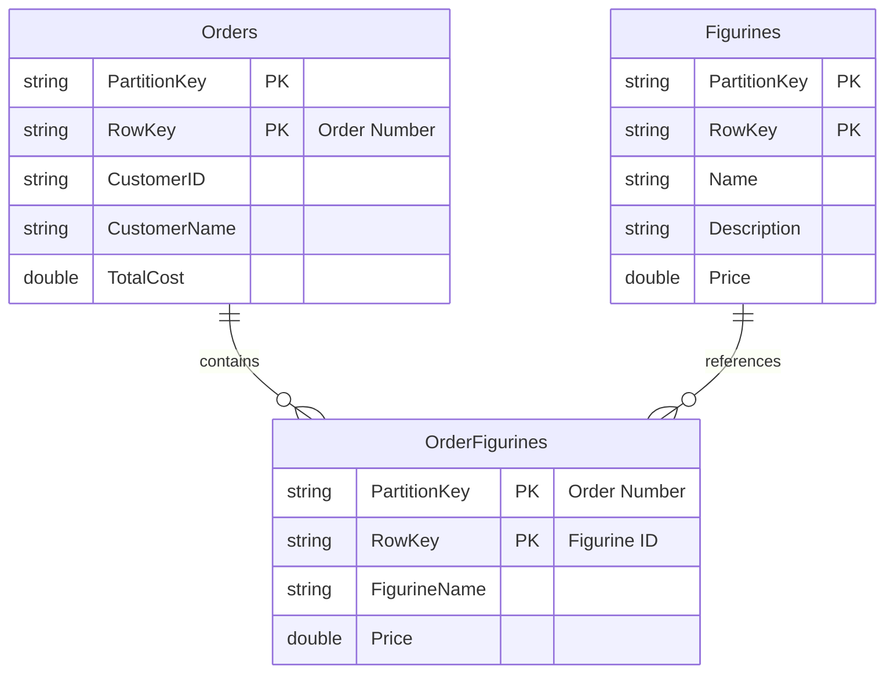
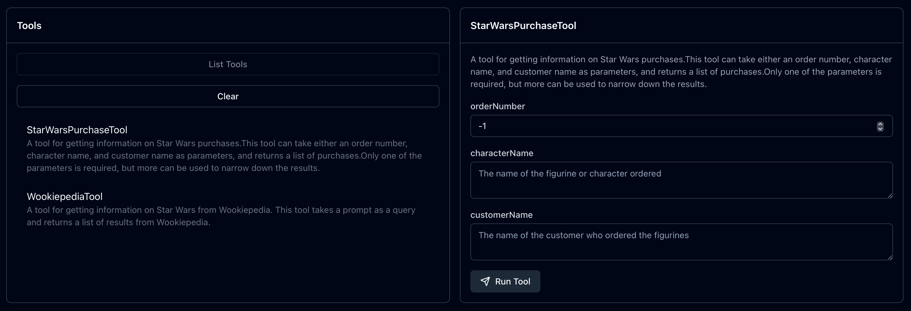
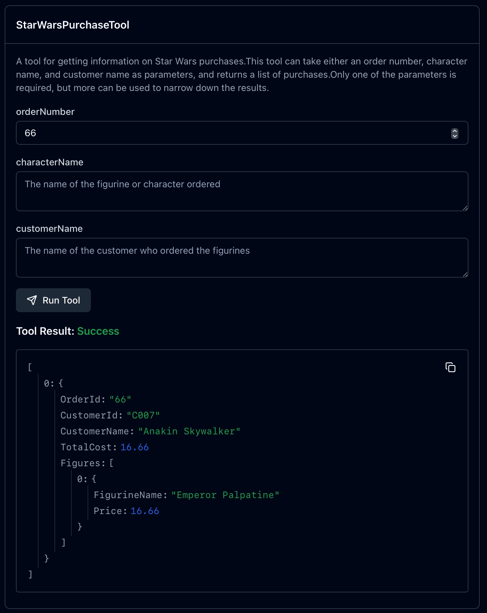

# RAG

In the [previous part](../5-mcp/README.md) you learned all about MCP as a standard for tool calling and reusable tools, and convert your Wookiepedia tool to an MCP server.

In this you will learn:

- What is Retrieval-Augmented generation (RAG)?
- How to use RAG with a traditional database

## What is  Retrieval-Augmented generation (RAG)?

Retrieval-Augmented generation (or RAG), is the process of augmenting the generation of text from an LLM using data retrieved from somewhere. You combine traditional information retrieval services with generative AI.

You've actually implemented RAG already - the tool you created retrieved data from Wookiepedia and used it to augment the generated results from the LLM. RAG is more than just internet search, it can involve retrieving data from any source including databases, document stores, APIs, and more.

Some use cases for RAG are:

- Customer service chatbots that can retrieve customer information from a database
- Internal HR chatbots to ask questions over corporate documents, like healthcare plans, or HR policies
- Financial service agents that can retrieve account information and stock prices, and use these to recommend investments

## Create a RAG tool for accessing a database

Let's create a RAG tool in our Star Wars MCP server that can retrieve details about purchases of Star Wars figurines. You'll be querying a database in Azure Storage, and your instructor has created this for you already and populated it with data.

This database has 3 tables:

- **Figurines** - this table contains a list of Star Wars characters that you can buy as a figurine, with a name, cost, and description
- **Orders** - this table contains a list of orders, with the order number, the customer who placed the order, and the total order cost
- **OrderFigurines** - this table links the orders to figurines, with one or more rows for each order, with a list of figurines that was in that order



### Add configuration

Open the `StarWarsMCPServer` project.

1. Add a new user secret for the Azure Storage connection string

    ```bash
    dotnet user-secrets set "AzureStorage:ConnectionString" "..."
    ```

    Your instructor can provide the connection string.

1. Add a new property to the `ToolsOptions` class for the connection string, along with a backing field:

    ```cs
    private static readonly string? _azureStorageConnectionString;
    public static string AzureStorageConnectionString => _azureStorageConnectionString!;
    ```

1. Load this connection string in the constructor after the code to load the Tavily API key:

    ```cs
    if (!secretProvider.TryGet("AzureStorage:ConnectionString", out _azureStorageConnectionString))
    {
        throw new InvalidOperationException("AzureStorage:ConnectionString is not configured in User Secrets.");
    }
    ```

### Add the tool

The tool we will be adding can load details from the tables using one or more combinations of order Id, customer name, or the character name of the figurine.

1. Add the `Azure.Data.Tables` NuGet package so that your tool can interact with Azure Storage tables:

    ```bash
    dotnet add package Azure.Data.Tables
    ```

1. Add a using directive for this package to the top of the `StarWarsTools` class:

    ```cs
    using Azure.Data.Tables;
    ```

1. Add the following two helper functions to the `StarWarsTools` class:

    ```cs
    private static async Task<List<TableEntity>> GetOrders(TableServiceClient serviceClient, int orderNumber, string customerName)
    {
        var ordersFilter = new List<string>();

        if (orderNumber > 0)
            ordersFilter.Add($"RowKey eq '{orderNumber}'");

        if (!string.IsNullOrWhiteSpace(customerName))
            ordersFilter.Add($"CustomerName eq '{customerName.Trim()}'");

        var combinedOrderFilter = ordersFilter.Count == 0 ? null : string.Join(" and ", ordersFilter);

        var ordersTbl = serviceClient.GetTableClient("Orders");
        var ordersQuery = ordersTbl.QueryAsync<TableEntity>(combinedOrderFilter);
        var orders = new List<TableEntity>();
        await foreach (var order in ordersQuery)
        {
            orders.Add(order);
        }

        return orders;
    }

    private static async Task<Dictionary<string, TableEntity>> GetFigurines(TableServiceClient serviceClient, string characterName)
    {
        var figurinesFilter = new List<string>();

        if (!string.IsNullOrWhiteSpace(characterName))
            figurinesFilter.Add($"Name eq '{characterName.Trim()}'");

        var combinedFigurineFilter = figurinesFilter.Count == 0 ? null : string.Join(" and ", figurinesFilter);

        var figurinesTbl = serviceClient.GetTableClient("Figurines");
        var figurinesQuery = figurinesTbl.QueryAsync<TableEntity>(combinedFigurineFilter);
        var figurines = new List<TableEntity>();
        await foreach (var figurine in figurinesQuery)
        {
            figurines.Add(figurine);
        }

        return figurines.ToDictionary(f => f.RowKey);
    }
    ```

    These helper functions get orders or figurines from the Azure Storage tables.

1. Add the following MCP server tool function to the `StarWarsTools` class:

    ```cs
    [McpServerTool(Name = "StarWarsPurchaseTool"),
     Description("A tool for getting information on Star Wars figurine purchases." +
                 "This tool can take either an order number, character name, and customer name as parameters, and returns a list of purchases." +
                 "Only one of the parameters is required, but more can be used to narrow down the results.")]
    public static async Task<string> GetStarWarsPurchases([Description("The order number")] int orderNumber = -1,
                                                          [Description("The name of the figurine or character ordered")] string characterName = "",
                                                          [Description("The name of the customer who ordered the figurines")] string customerName = "")
    {
    }
    ```

    This tool has a description that tells the LLM that it gets details of Star Wars purchases, using one or more of three parameters including the order number, the customer name, or the character name for the figurine.

1. Add the following code to the body of the `GetStarWarsPurchases` function:

    ```cs
    try
    {
        if (orderNumber <= 0 &&
            string.IsNullOrWhiteSpace(characterName) &&
            string.IsNullOrWhiteSpace(customerName))
        {
            return JsonSerializer.Serialize(new { error = "At least one parameter is required: orderNumber, characterName, or customerName." });
        }

        var serviceClient = new TableServiceClient(ToolsOptions.AzureStorageConnectionString);

        // Get the orders that match the provided order number or customer name
        var orders = await GetOrders(serviceClient, orderNumber, customerName);

        // Get the figurines that match the character name
        // If this parameter is not provided, it will return all figurines
        // Otherwise there should be only one
        var figurines = await GetFigurines(serviceClient, characterName);
        if (figurines.Count == 0 && !string.IsNullOrWhiteSpace(characterName))
        {
            return JsonSerializer.Serialize(new { error = $"No figurines found for character '{characterName}'." });
        }

        var results = new List<object>();

        var orderFigTbl = serviceClient.GetTableClient("OrderFigurines");
        foreach (var order in orders)
        {
            var orderId = order.RowKey;
            var figuresFilter = $"PartitionKey eq '{orderId}'";
            // If we are filtering by character name, we need to check if the figurine matches
            if (!string.IsNullOrWhiteSpace(characterName))
            {
                figuresFilter += $" and FigurineName eq '{characterName}'";
            }

            var orderFigurines = orderFigTbl.QueryAsync<TableEntity>(figuresFilter);

            // Get all the figurines for this order that match the character name
            // If character name is not provided, it will return all figurines for the order
            var figurinesList = new List<object>();
            await foreach (var f in orderFigurines)
            {
                if (figurines.TryGetValue(f.RowKey, out var figurine))
                {
                    figurinesList.Add(new
                    {
                        FigurineId = f.RowKey,
                        FigurineName = figurine.GetString("Name"),
                        Price = figurine.GetDouble("Price"),
                        Description = figurine.GetString("Description")
                    });
                }
            }

            // Only add the order to the results if it has figurines
            if (figurinesList.Count != 0)
            {
                results.Add(new
                {
                    OrderId = orderId,
                    CustomerId = order.GetString("CustomerID"),
                    CustomerName = order.GetString("CustomerName"),
                    TotalCost = order.GetDouble("TotalCost"),
                    Figures = figurinesList
                });
            }
        }

        // Return the results as a JSON string
        return JsonSerializer.Serialize(results);
    }
    catch (Exception ex)
    {
        return JsonSerializer.Serialize(new { error = ex.Message });
    }
    ```

    This code takes the parameters and uses them to load the relevant orders, returning these as JSON.

1. Use the MCP Inspector to try this tool out. This time when you list the tools you will see the `StarWarsPurchaseTool`, and be able to query it.

    

    Try setting some values in the tool and running it. For example, search for order 66, or purchases by Ben Smith.

    

    > When this does a look up on the database, it will be case sensitive, so ensure you use the right case when asking for details about purchases. For example, asking which figurines **Ben Smith** purchased would work, but **Ben smith** (lower case S on Smith) will fail.
    >
    > The customers are:
    >
    > - Luke Johnson
    > - Leia Parker
    > - Han Richards
    > - Ben Smith
    > - Yoda Masterson
    > - Rey Fisher
    > - Anakin Skywalker
    > - Padmé Amidala
    > - Lando Calrissian
    > - Obi Wan

## Use the new tool

We've added the new tool to the MCP server. The MCP client in the copilot queries the MCP server and gets all the tools, so there is nothing we need to do to configure this new tool in the copilot, it just works! When the copilot is restarted, it will read the tools and discover the new one. This is one of the powerful features of MCP.

To try this out, relaunch the copilot and ask questions about orders:

```output
User > What was purchased in order 66? Give me details about the order including the customer, and details about the character.
Assistant > Purchased in order 66, a figurine of Emperor Palpatine was. The customer was Anakin Skywalker, hmmm. Cost, 16.66 credits it was. Emperor Palpatine, also known as Darth Sidious, a powerful Sith Lord he is. Manipulated the galaxy into war and chaos, he did. His cunning and dark-side power allowed him to rise as Galactic Emperor. Beware, young one, paths to the dark side bring suffering and destruction. Choose wisely, you must.
```

The Copilot now knows about purchases of Star Wars figurines, and when you ask a relevant question it is able to augment the generated results with real world data retrieved from the MCP server.

## Summary

In this part you learned about Retrieval-Augmented generation (RAG) for retrieving information for the LLM to use.

In the [next part](../7-multimodal/README.md) you will learn about using multi-modal AI, and add a tool that uses AI to generate images from a text prompt.
