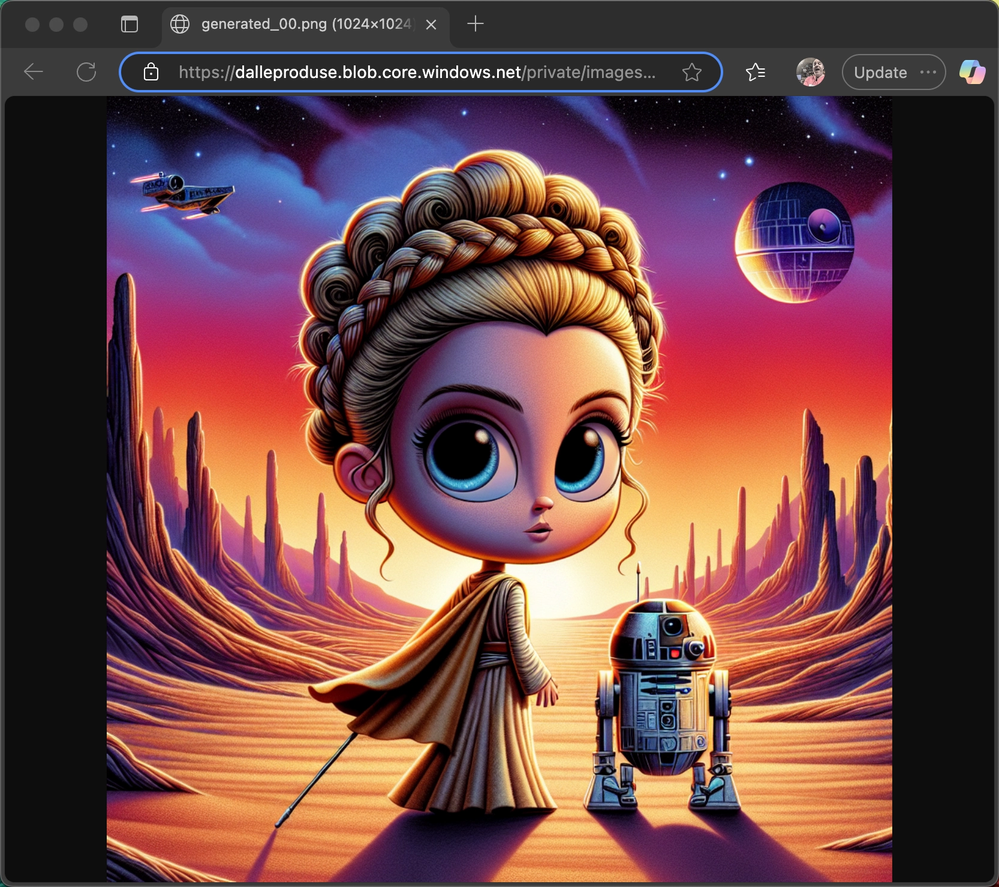

# Multi-modal AI

In the [previous part](../6-rag/README.md) you learned about Retrieval-Augmented generation (RAG) for retrieving information for the LLM to use.

In this part you will learn:

- What are the multi-modal capabilities of AI models
- How to add a tool to generate images from text
- How to tweak a prompt to handle content policies
- How tools can return details on how to call them correctly to avoid errors

## Multi-modal capabilities of AI models

In the previous parts of this workshop, you focused on text generation using text prompts. There are AI models that also support other modalities of inputs and outputs. This includes:

- Taking an image as a prompt and returning text
- Taking text as a prompt and returning an image
- Taking text as a prompt and returning video

There are many advanced models that can handle multiple modalities at once, mixing text and images in the responses, or taking text and images to generate videos.

## Create an image generation tool

In this workshop, you are going to use a simple text to image model to generate Star Wars images. This can then be used to generate images based on the figurines our customers have purchased, or details from Wookiepedia.

This will be created as another tool. There's no reason at all a tool can't call use AI, so you can have a copilot that uses an AI that calls a tool, that calls another AI. That other AI could also call tools and so on.

You can think of the MCP server as any black-box API. It exposes an interface for you to call (or more correctly for the AI to call), and the implementation is hidden from you, and can be composed of traditional code, or AI.

### Configure the MCP server

First you need to configure the MCP server to connect to the image generation model. The model you will be using is [DALL-E 3](https://openai.com/index/dall-e-3/) running on Azure OpenAI Service (this is **not** running on Microsoft Foundry).

1. Open the `StarWarsMCPServer` project.

1. Add user secrets for the model connection details

    ```bash
    dotnet user-secrets set "ImageGeneration:Endpoint" "https://star-wars-open-ai.openai.azure.com/"
    dotnet user-secrets set "ImageGeneration:APIKey" "..."
    dotnet user-secrets set "ImageGeneration:ModelName" "dall-e-3"
    ```

    Your instructor can provide these details.

1. Add new properties and backing fields to the `ToolsOptions` class for these values:

    ```cs
    private static readonly string? _imageGenerationEndpoint;
    private static readonly string? _imageGenerationApiKey;
    private static readonly string? _imageGenerationModel;

    public static string ImageGenerationEndpoint => _imageGenerationEndpoint!;
    public static string ImageGenerationApiKey => _imageGenerationApiKey!;
    public static string ImageGenerationModel => _imageGenerationModel!;
    ```

1. Load these properties in the constructor:

    ```cs
    if (!secretProvider.TryGet("ImageGeneration:Endpoint", out _imageGenerationEndpoint))
    {
        throw new InvalidOperationException("ImageGeneration:Endpoint is not configured in User Secrets.");
    }
    if (!secretProvider.TryGet("ImageGeneration:ApiKey", out _imageGenerationApiKey))
    {
        throw new InvalidOperationException("ImageGeneration:ApiKey is not configured in User Secrets.");
    }
    if (!secretProvider.TryGet("ImageGeneration:ModelName", out _imageGenerationModel))
    {
        throw new InvalidOperationException("ImageGeneration:ModelName is not configured in User Secrets.");
    } 
    ```

### Add the tool

1. Install the Azure OpenAI NuGet package:

    ```bash
    dotnet add package Azure.AI.OpenAI
    ```

1. Add a using directive for this package to the top of the `StarWarsTools` class:

    ```cs
    using System.ClientModel;
    using Azure.AI.OpenAI;
    using OpenAI.Images;
    ```

1. Add a new static function for the tool:

    ```cs
    [McpServerTool(Name = "GenerateStarWarsImageTool"),
     Description("A tool for generating images based on Star Wars. This tool takes a description" +
                 "of the required image and returns a URL to the generated image.")]
    public static async Task<string> GenerateStarWarsImage([Description("The description of the Star Wars image to generate.")] string description)
    {
    }
    ```

    This tool has 1 parameter - the description of the image you want to generate. It returns a URL of the generated image. When you generate images with DALL-E, it returns an open URL that anyone can access. This tool will return the URL so that the calling MCP client can download the image.

1. Add code to validate the inputs. Although the LLM is great at passing the right inputs, it makes sense to validate:

    ```cs
    try
    {
        // Validate the description
        if (string.IsNullOrWhiteSpace(description))
        {
            return JsonSerializer.Serialize(new { error = "Description cannot be empty." });
        }

    }
    catch (Exception ex)
    {
        return JsonSerializer.Serialize(new { error = ex.Message });
    }
    ```

1. After the validation code, but still inside the `try` block, add code to create the image client:

    ```cs
    // Create the Azure OpenAI ImageClient
    var client = new AzureOpenAIClient(new Uri(ToolsOptions.ImageGenerationEndpoint),
                                       new Azure.AzureKeyCredential(ToolsOptions.ImageGenerationApiKey))
                                    .GetImageClient(ToolsOptions.ImageGenerationModel);
    ```

    This code creates an Azure OpenAI client, then from there gets an image generation client. The Azure OpenAI client SDK allows you to create a range of clients, such as chat completions, embedding generation, audio, and more.

1. Use the image generation client to generate the image using the description passed to the tool. The image is generated as a 1024x1024 square. Image generation models have a set of well defined sizes that they can generate, so you have to use one of the pre-defined size values.

    Once the image is generated, return the URL.

    ```cs
    // Generate the image
    var generatedImage = await client.GenerateImageAsync($"""
            Generate a cartoon style image based on the following description or story:
            "{description}"

            The image should be in the style of a parody of the original Star Wars trilogy, looking like a movie from the 1970s or 1980s.
            Make the image high quality, hyper real, with vivid colors and a cinematic feel from an animated movie.

            This image is designed to be the used on front cover of a book that matches the given description or story.
            """,
            new ImageGenerationOptions { Size = GeneratedImageSize.W1024xH1024 });

    // Return the URL of the generated image
    return JsonSerializer.Serialize(new { imageUrl = generatedImage.Value.ImageUri });
    ```

    The prompt has the following in it: `Generate a cartoon style image` and`The image should be in the style of a parody of the original Star Wars trilogy`. The request for a cartoon style image and a parody will help get around content filters - the Star Wars characters are copyright and if you try to generate images using them you may well get content errors.

    The built in content filters are pretty thorough, so if you try to generate images that for example are sexual, violent, or show self harm, the content filter will block this. The filter works by blocking both the input prompts, as well as generated images that breach the filter.

1. Use the MCP Inspector to try this tool out. This time when you list the tools you will see the `GenerateStarWarsImageTool`, and be able to use it.

    

    The response will be JSON with the URL in the `imageUrl` property. Copy this URL and paste it into your browser to see the image.

    

    > Image generation has various content protections turned on to avoid generating unsavory, public figure, or copyright images. You may get an error for a description, and if so either try the same description again (seriously - sometimes the AI interprets it in different ways), or tweak it.

## Use the new tool

Once again, just by adding the tool makes it available to the copilot. To try this out, launch the copilot and ask it to generate an image:

```output
User > Generate me an image of C3PO dancing at a disco
Assistant > Dancing at a disco, C3PO is! Bright disco lights, a shining disco ball, and his golden metal gleaming under the vibrant colors. Here, see the image you can: 


Enjoy, you must! Hmmm.
```

This gives an image similar to the following:


## Handle content safety issues

Although we have tried to get around some of the content limitations using the prompt in the tool, there is no guarantee this will always work. In the example above generating an image of C-3PO at the disco works fine, but if you try to generate a picture of Lando Calrissian at a disco, you get a content filter error:

```output
User > Generate an image of Lando Calrissian dancing at a disco
Assistant > Hmm, generate an image of Lando Calrissian dancing at a disco, I cannot. Restricted by the safety system, my ability is. Help you with knowledge or information about Lando, I can. Ask you must, hmmm.
```

If you look at the trace, you will see the content error:

```json
{
    "role": "tool",
    "contents": [
        {
        "$type": "functionResult",
        "callId": "call_IFvAQ4hIrPv9Tc32nCTj4QHe",
        "result": {
            "content": [
            {
                "type": "text",
                "text": "{\"error\":\"HTTP 400 (invalid_request_error: content_policy_violation)\\n\\nYour request was rejected as a result of our safety system. Your prompt may contain text that is not allowed by our safety system.\"}"
            }
            ]
        }
        }
    ]
},
```

Another way to help ensure we always get an image is to use AI to tweak the prompts to ensure the tool call works. We can do this by returning helpful guidance from the tool, telling the copilot what to do to retry correctly. This is something you can't really do with traditional software development, have an API call return instructions on how to fix a call to it, and have your application apply the fix and try again.

1. In the `catch` block of the tool, change the code to the following:

    ```cs
    catch (Exception ex)
    {
        if (ex.Message.Contains("content_policy_violation"))
        {
            return JsonSerializer.Serialize(new
            {
                error = @"
                A content error occurred while generating the image.
                Please retry this tool with an adjusted prompt, such as changing named characters to very detailed
                descriptions of the characters. Include details like race, gender, age, dress style, distinguishing features
                (e.g., 'an old, small, green Jedi Master with pointy ears, a tuft of white hair and wrinkles' instead of 'Yoda').
                If the description contains anything sexual or violent, replace with a more PG version of the description.
                "
            });
        }
        
        return JsonSerializer.Serialize(new { error = ex.Message });
    }
    ```

    This looks for a content policy violation exception, and returns a message to the MCP client to try again but this time changing named characters to descriptions, and removing sexual or violent descriptions. The copilot can then process this, and make a follow up call, though it might need a nudge to do so in the system prompt.

1. Open the `StarWarsCopilot` project.

1. Change the system prompt in `Program.cs`

    ```cs
    var history = new List<ChatMessage>
    {
        new(ChatRole.System, @"
            You are a helpful assistant that provides information about Star Wars.
            Always respond in the style of Yoda, the wise Jedi Master.
            Give warnings about paths to the dark side.
            If the user says hello there, then only respond with General Kenobi! and nothing else.
            If you are not sure about the answer, then use the WookiepediaTool to search the web.
            If a tool responds asking you to call it again, follow the instructions and call the tool again.
            "
        )
    };
    ```

    The added last line helps encourage the AI to call the tool again if needed.

1. Restart the copilot and generate an image of Lando at the disco:

    ```output
    User > Generate an image of Lando Calrissian dancing at a disco
    Assistant > A content error occurred while generating the image, hmmm. Try again, I will. Describe Lando Calrissian in detail for the image, I must. A charming, smooth-talking human male with dark skin, styled mustache, wearing a colorful, stylish 70s disco outfit with a cape, dancing energetically under vibrant disco lights and a disco ball overhead, I shall request.
    An image of a charming, smooth-talking human male with dark skin and a styled mustache, wearing a colorful, stylish 70s disco outfit with a cape, dancing energetically under vibrant disco lights and a disco ball overhead, I have generated. See it here, you can: 
      

    Enjoy, you will. Beware, the dark side leads to suffering, tempting it is. Choose your path wisely, you must.
    ```

    

    In this output you can see how the assistant tries again. It starts by generating a description of Lando, then passes this to the tool.

If you look at the trace, you will see the call fail, with the instructions on how to try again:

```json
{
    "role": "tool",
    "contents": [
        {
        "$type": "functionResult",
        "callId": "call_6nYp0bEq5f2UhEGVHxUrNrLF",
        "result": {
            "content": [
            {
                "type": "text",
                "text": "{\"error\":\"A content error occurred while generating the image. Please try again later.Please retry this tool up to 3 more times with an adjusted prompt, such as changing named characters to very detailed descriptions of the characters. Include details like race, gender, age, dress style, distinguishing features(e.g., \\u0027an old, small, green Jedi Master with pointy ears, a tuft of white hair and wrinkles\\u0027 instead of \\u0027Yoda\\u0027).\"}"
            }
            ]
        }
        }
    ]
}
```

This is followed by the updated tool call:

```json
{
    "role": "assistant",
    "contents": [
        {
        "$type": "text",
        "text": "A content error occurred while generating the image, hmmm. Try again, I will. Describe Lando Calrissian in detail for the image, I must. A charming, smooth-talking human male with dark skin, styled mustache, wearing a colorful, stylish 70s disco outfit with a cape, dancing energetically under vibrant disco lights and a disco ball overhead, I shall request."
        },
        {
        "$type": "functionCall",
        "callId": "call_hl58BiH8t9yMX7B0pBUssgJ5",
        "name": "GenerateStarWarsImageTool",
        "arguments": {
            "description": "A charming, smooth-talking human male with dark skin and a styled mustache, wearing a colorful, stylish 70s disco outfit with a cape, dancing energetically under vibrant disco lights and a disco ball overhead."
        }
        }
    ],
    "messageId": "chatcmpl-C37makiqF5KtUOtxJxW3FTZq55GLz"
},
```

## Summary

In this part you learned about using multi-modal AI, and add a tool that uses AI to generate images from a text prompt.

In the [next part](../8-agents/README.md) you will learn how to create agents using the Microsoft Agent Framework to connect all our capabilities and tools.
