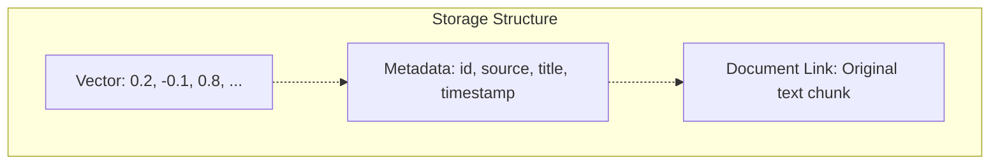
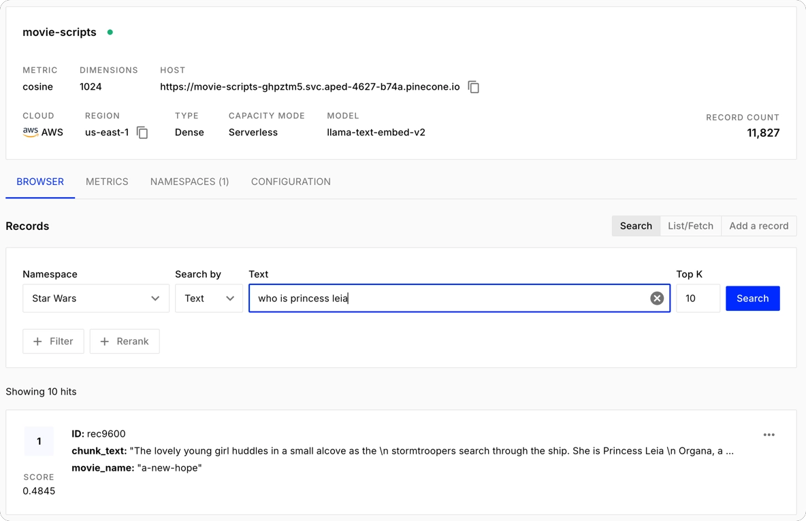
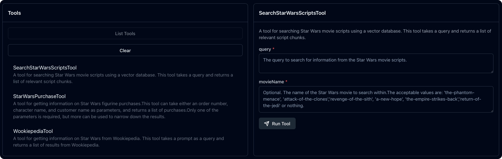
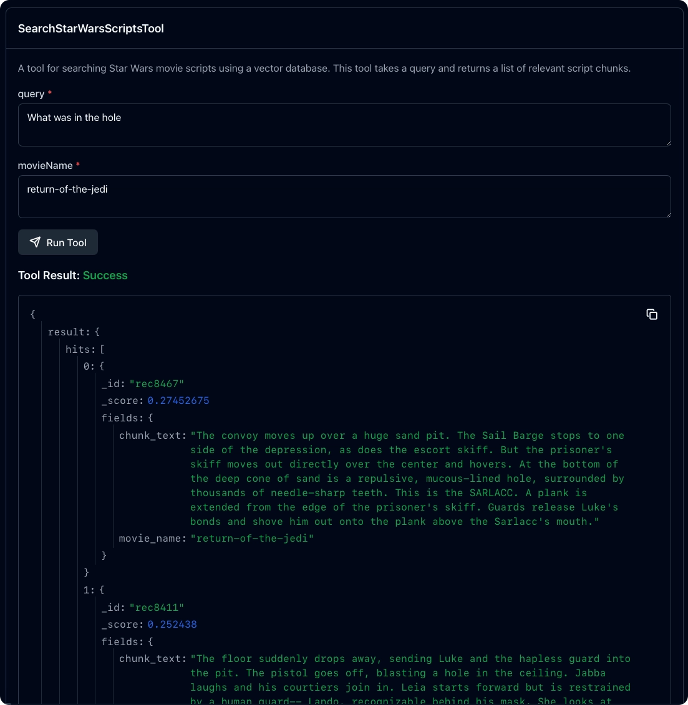

# Vector databases

In the [previous part](../6-rag/README.md) you learned about Retrieval-Augmented generation (RAG) for retrieving information for the LLM to use.

In this part you will learn:

- What are vector databases?
- How to upload documents to a vector database
- How to query a vector database for RAG

## What are vector databases

Traditional databases store information using either tables or document stores, and you can search based in the information that is in there. This is great when you know the information that you are searching for, but fall down when you need to search for something without knowing exactly what it is.

For example, if you wanted to find out more about the scene in Return of the Jedi set on the forest moon of Endor, but couldn't remember that it was a moon and searched for "forest planet" then a traditional database wouldn't return anything. Forest planet wouldn't match any data.

This doesn't work well with LLMs that are able to have a semantic understanding of what you are asking. For example, if you asked an LLM about the forest planet, it would give you the right information:

```output
User > What is the forest planet in Return of the Jedi?
Assistant > Ah, the forest planet in "Return of the Jedi," it is the forest moon of Endor. A lush, green world with dense forests and towering trees, home to the Ewoks it is. Small, brave creatures the Ewoks are, they helped the Rebel Alliance in the battle against the Empire. Remember, victory often comes from unexpected allies, yes, hmmm.
```

Vector databases are different to traditional databases. These are designed to work with LLMs. Instead of storing raw data, they store embeddings, which are numerical relationships between the tokens that would make up the data. These are stored in multi-dimensional vectors, with the directionality defined by similarity. If this sounds complicated, it is!

The important information here is - vector databases store similar information together, and you can then do a similarity search. For example, "moon" and "planet" are similar, so you can search for "planet" and get back "moon".

This makes them ideal for searching to get data to use with LLMs. You can ask the LLM a question, then perform RAG with a vector database to get information that is similar to what you asked for. For example, imagine an HR chatbot to get information on company policies, and you search for the "vacation policy", but the document is actually called "time off policy" and uses the term time off throughout instead of vacation. A traditional database query wouldn't find this, but a vector search would.

## How data is stored in a vector database

Vector databases take the documents you want to store, break them up into chunks, then indexes these chunks using vectors, storing metadata in the index linking back to the chunks, which in turn have metadata linking back to the original document. This allows you to search the index, then from there get back to the original content.



Chunk sizing varies, and depends on factors like the token limits of the models that create the embeddings, the content type, and the type of information you have. Smaller chunks are more precise but lose context, larger chunks have better context, but less focused results.

## Pinecone

Pinecone is a popular vector database that runs as a SaaS tool, or as a hosted service on your cloud. Pinecone indexes your data using internal embedding models, or using embeddings generated by the model of your choice, such as OpenAI. It also has a generous free tier.

You will be using Pinecone to store and index the scripts for some of the Star Wars movies to allow you to search for information without having to remember the exact details. You will create a helper project to upload the movie scripts. The search will be added to the MCP server as another tool.

### Create a free Pinecone account

1. Head to [Pinecone.io](https://pinecone.io), and sign up for a free account.

1. You will be provided an API key. Make sure you copy and save this as you will only see it once.

### Create the uploader tool

1. Create a new folder called `VectorDataloader`, and open this in your IDE.

1. In this folder, create a new .NET console project:

    ```bash Terminal
    dotnet new console
    ```

1. Add the Pinecone NuGet package to this project:

    ```bash
    dotnet add package Pinecone.Client 
    ```

1. The scripts are in the [movie-scripts.zip](./movie-scripts.zip) file. Download this file, and unzip it to the root of the `VectorDataloader` project. This should give you a folder in that project called `movie-scripts`.

1. Add an entry to the `VectorDataloader.csproj` file to copy the movie scripts to the output directory:

    ```xml
    <ItemGroup>
      <Content Include="movie-scripts\*.*">
        <CopyToOutputDirectory>Always</CopyToOutputDirectory>
      </Content> 
    </ItemGroup>
    ```

1. Delete all the code in the `Program.cs` file, and add a using directive for Pinecone:

    ```cs
    using Pinecone
    ```

1. Declare a couple of variables for the Pinecone client, and index name. A Pinecone database is referred to as an index.

    ```cs
    var pinecone = new PineconeClient("API_KEY");
    var indexName = "movie-scripts";
    ```

    Replace `API_KEY` with your Pinecone API key.

1. Add the following code to create the index:

    ```cs
    // Create the index if it does not exist
    var createIndexRequest = new CreateIndexForModelRequest
    {
        Name = indexName,
        Cloud = CreateIndexForModelRequestCloud.Aws,
        Region = "us-east-1",
        Embed = new CreateIndexForModelRequestEmbed
        {
            Model = "llama-text-embed-v2",
            FieldMap = new Dictionary<string, object?>()
            {
                { "text", "chunk_text" },
            }
        }
    };
    
    var index = await pinecone.CreateIndexForModelAsync(createIndexRequest);

    // Wait for the index to be ready
    while (!index.Status.Ready)
    {
        await Task.Delay(5000);
        index = await pinecone.DescribeIndexAsync(indexName);
    }
    ```

    Even though the call to `CreateIndexForModelAsync` returns, there is no guarantee that the index is ready, so you need to check the status and wait if it is not yet ready.

    > This code assumes your index does not exist. If you need to re-run this code, delete the index from your Pinecone console.

1. Next you need to upload the scripts. These need to be chunked, with each chunk uploaded and indexed. You will be using simple paragraph chunking, but there are many ways to do this and the best way depends on many factors including your data and the kind of application you are building.

    > You can learn more int the [Pinecone chunking strategies documentation](https://www.pinecone.io/learn/chunking-strategies/).

    Add the following code to load the scripts, chunk them, then upload them:

    ```cs
    // Get a client for the new index
    var indexClient = pinecone.Index(indexName);
    var recordNumber = 0;
    
    // Load the scripts into the index
    var scriptsPath = Path.Combine(AppContext.BaseDirectory, "movie-scripts");
    foreach (var scriptFile in Directory.GetFiles(scriptsPath, "*.md"))
    {
        var movieName = Path.GetFileNameWithoutExtension(scriptFile);
        Console.WriteLine($"Processing script: {movieName}");
    
        List<UpsertRecord> records = [];
    
        // Chunk the script content into manageable pieces
        var scriptContent = await File.ReadAllTextAsync(scriptFile);
        var chunks = scriptContent.Split(["\n\n"], StringSplitOptions.TrimEntries | StringSplitOptions.RemoveEmptyEntries);
    
        foreach (var chunk in chunks)
        {
            records.Add(new UpsertRecord
            {
                Id = $"rec{recordNumber++}",
                AdditionalProperties =
                {
                    ["chunk_text"] = chunk,
                    ["movie_name"] = movieName,
                },
            });
    
            // Pinecone has a limit of 96 records per upsert operation
            if (records.Count >= 96)
            {
                // Upsert the records to Pinecone
                await indexClient.UpsertRecordsAsync("Star Wars", records);
                records.Clear();
            }
        }
    
        // Upsert any remaining records
        await indexClient.UpsertRecordsAsync("Star Wars", records);
        Console.WriteLine($"\nFinished processing script: {movieName}");
    }
    ```

    This code gets an index client to use to upload records to the index. It then loads each script file, chunks them by paragraph, then uploads each chunk with an incrementing record number, and the movie name. This allows you to filter by movie name later.

    When you upload records, they can be grouped into namespaces, which can be searched separately. In this case, everything is being uploaded to the `"Star Wars"` namespace.

    Pinecone uploads are limited to 96 records at a time, so every time 96 chunks are ready, they are uploaded and the list is cleared.

1. Run the app. It will run, uploading any data.

    > If you get any issues and need to re-run it, you will need to delete the index from the Pinecone console.

1. Once run you will see the new index in the Pinecone console. You can then select it, and run queries against it.

    

You now have index data ready to search against. Now you can add a tool to the MCP server to search this vector database.

### Configure the MPC server

Open the `StarWarsMCPServer` project.

1. Add a new entry to the `appsettings.json` file for the Pinecone API key:

    ```json
    {
        "Tools": {
            "TavilyApiKey": "",
            "StorageConnectionString": "",
            "PineconeApiKey": ""
        }
    }
    ```

1. Add a new property to the `ToolsOptions` class for this key:

    ```cs
    /// <summary>
    /// The Pinecone API key
    /// </summary>
    [Required]
    public string PineconeApiKey { get; set; } = string.Empty;
    ```

### Add the tool

The tool you will be adding starts by creating the index if it doesn't exist, and uploads the scripts, using the built-in Pinecone models to create embeddings.

1. Install the Pinecone NuGet package:

    ```bash
    dotnet add package Pinecone.Client 
    ```

1. Add a using directive for this package to the top of the `StarWarsTools` class:

    ```cs
    using Pinecone;
    ```

1. Add 2 new fields, one for the Pinecone client, and one for the index name:

    ```cs
    private readonly static PineconeClient _pinecone;
    private readonly static string _indexName = "movie-scripts";
    ```

1. In the `StarWarsTools` constructor, create the Pinecone client using the API key from the tools options:

    ```cs
    // Create the Pinecone client
    _pinecone = new PineconeClient(_toolsOptions.PineconeApiKey);
    ```

1. Add a new static function for the tool:

    ```cs
    [McpServerTool(Name = "SearchStarWarsScriptsTool"),
     Description("A tool for searching Star Wars movie scripts using a vector database. " +
                 "This tool takes a query and returns a list of relevant script chunks.")]
    public static async Task<string> SearchStarWarsScripts([Description("The query to search for information from the Star Wars movie scripts.")] string query,
                                                           [Description("Optional. The name of the Star Wars movie to search within." +
                                                                        "The acceptable values are: 'the-phantom-menace', 'attack-of-the-clones'," +
                                                                        "'revenge-of-the-sith', 'a-new-hope', 'the-empire-strikes-back'," +
                                                                        "'return-of-the-jedi' or nothing.")] string? movieName)
    {
    }
    ```

    This tool has 2 parameters - the query, and an optional parameter for the movie name. The movie name has to match the `movie_name` field set in when you uploaded records to Pinecone, so the description for this field provides the allowed values.

    This instruction is passed to the LLM, so when it makes the tool call it will actually work out what the correct value is - so if you ask a question about "Phantom Menace", it will match that to `"the-phantom-menace"` and pass that value.

1. Add code to validate the inputs. Although the LLM is great at passing the right inputs, it makes sense to validate:

    ```cs
    try
    {
        // Validate the query
        if (string.IsNullOrWhiteSpace(query))
        {
            return JsonSerializer.Serialize(new { error = "Query cannot be empty." });
        }

        // Validate the movie name
        var validMovies = new[]
        {
            "the-phantom-menace",
            "attack-of-the-clones",
            "revenge-of-the-sith",
            "a-new-hope",
            "the-empire-strikes-back",
            "return-of-the-jedi"
        };

        if (!string.IsNullOrWhiteSpace(movieName) && !validMovies.Contains(movieName.ToLowerInvariant()))
        {
            return JsonSerializer.Serialize(new { error = $"Invalid movie name '{movieName}'. Valid options are: {string.Join(", ", validMovies)}." });
        }

    }
    catch (Exception ex)
    {
        return JsonSerializer.Serialize(new { error = ex.Message });
    }
    ```

1. After the validation code, but still inside the `try` block, add code to create the search request:

    ```cs
    // Create the search request
    var searchRequest = new SearchRecordsRequestQuery
    {
        TopK = 20,
        Inputs = new Dictionary<string, object?> { { "text", query } },
    };

    // If a movie name is provided, filter the search results to only include that movie
    if (!string.IsNullOrWhiteSpace(movieName))
    {

        searchRequest.Filter = new Dictionary<string, object?> { { "movie_name", movieName.ToLowerInvariant() } };
    }
    ```

    This searches based on the passed in query. The `TopK` setting indicates how many records to return, based off the top hits. This is set to 20, to return the top 20 most relevant results. If the movie name is provided, it is added as a filter.

1. After this, add code to run the query and return the results:

    ```cs
    // Perform the search using the Pinecone index
    var indexClient = _pinecone.Index(_indexName);
    var response = await indexClient.SearchRecordsAsync(
        "Star Wars",
        new SearchRecordsRequest
        {
            Query = searchRequest,
            Fields = ["movie_name", "chunk_text"],
        }
    );

    // Return the search results
    return JsonSerializer.Serialize(response);
    ```

    This gets an index client for the index name, then searches the Star Wars namespace, bringing back the movie name, and the chunk.

1. Use the MCP Inspector to try this tool out. This time when you list the tools you will see the `SearchStarWarsScriptsTool`, and be able to query it.

    

    Try a query, optionally adding a movie name. Remember this is querying the tool without an LLM, so you need to set the movie name to an allows value. For example, ask "What was in the hole" with the movie name set to `return-of-the-jedi` to get information about the Sarlacc pit.

    

    Review the results. You can click on each row, then on the fields, then on the chunk text to expand the chunk. For example, the result will contain this chunk:

    > "Han, Luke, Chewie, and Artoo are still bound to their poles. Han is placed on a spit above what looks like a barbecue pit and the others are leaned against a tree nearby. Threepio's litter/throne is gently placed near the pit. He watches with rapt fascination. Han, Luke, and Chewie are less than fascinated."

    There is no hole here, but the term "pit" is semantically similar to hole, so this result is returned.

## Use the new tool

As before, we've added the new tool to the MCP server. The MCP client in the copilot queries the MCP server and gets all the tools, so there is nothing we need to do to configure this new tool in the copilot, it just works!

To try this out, relaunch the copilot and ask questions about movie scripts. You don't need to pass the movie name identically to what the tool expects, it can work it out.

```output
User > What was in the hole in Return of the Jedi?
Assistant > In the hole in Return of the Jedi, there was the Sarlacc. A deep cone of sand contained a repulsive, mucous-lined hole surrounded by thousands of needle-sharp teeth. The Sarlacc dwelled there, waiting to trap its prey in the pit. Caution, you must take, for such places are filled with danger and dark side influence. Dangerous is the path that leads to such creatures. Beware, you should.
```

If you check the trace, you will see the tool call:

```output
StarWarsMCPServer sending method 'tools/call' request. Request: '{"method":"tools/call","params":{"name":"SearchStarWarsScriptsTool","arguments":{"query":"hole in Return of the Jedi","movieName":"return-of-the-jedi"}},"id":3,"jsonrpc":"2.0"}'.
```

Notice the arguments are set correctly: `{"query":"hole in Return of the Jedi","movieName":"return-of-the-jedi"}`. The movie name has been converted from Return of the Jedi in the query to `return-of-the-jedi`.

You will also see all the chunks in the trace.

### Combine all the tools

LLMs can use multiple tools at once, taking the results from one tool and passing it to another. For example, you can query orders, then use the results to query the scripts.

```output
User > What figurines did Ben Smith order, and for each one, look up what they did in Empire Strikes Back. Then give me a summary of how these characters worked together.
Assistant > Ordered by Ben Smith, the figurines are Chewbacca, Obi-Wan Kenobi, and Finn.

In The Empire Strikes Back:

- Chewbacca is a fierce Wookiee warrior and co-pilot of the Millennium Falcon. He is seen working on the ship, growling and communicating with his companions. Chewbacca is captured and imprisoned in Cloud City, showing his resilience and loyalty as he defends his friends and assists them even in captivity.
  
- Obi-Wan Kenobi, also known as Ben, though not physically present in the movie, plays a spiritual role. His wisdom guides Luke Skywalker in his quest to confront Darth Vader. Obi-Wan's teachings and past actions influence the events and Luke's training with Yoda on Dagobah.

- Finn does not appear in The Empire Strikes Back, as he belongs to a later timeline in the Star Wars saga. His story is one of defection from the First Order and joining the Resistance, symbolizing hope and change.

How these characters worked together, hmm:

Chewbacca, embodying loyalty and strength, physically supports his friends in their struggles and battles. Obi-Wan's wisdom and sacrifice provide spiritual guidance, influencing the younger generation like Luke to fight against darkness. Finn, though from a different era, represents the ongoing fight against tyranny and the importance of courage and redemption. Together, the values these characters represent—loyalty, wisdom, bravery—form a bond that strengthens the Resistance against the Empire's oppression.

Beware the dark side, young one. The physical might, the spiritual guidance, and the hope for change must align with the light, lest the darkness consume all. Hmmm.
```

The trace logs will show multiple tool calls:

```output
StarWarsMCPServer sending method 'tools/call' request. Request: '{"method":"tools/call","params":{"name":"StarWarsPurchaseTool","arguments":{"customerName":"Ben Smith"}},"id":5,"jsonrpc":"2.0"}'.
...
StarWarsMCPServer sending method 'tools/call' request. Request: '{"method":"tools/call","params":{"name":"SearchStarWarsScriptsTool","arguments":{"query":"Chewbacca","movieName":"the-empire-strikes-back"}},"id":6,"jsonrpc":"2.0"}'.
...
StarWarsMCPServer sending method 'tools/call' request. Request: '{"method":"tools/call","params":{"name":"SearchStarWarsScriptsTool","arguments":{"query":"Obi-Wan Kenobi","movieName":"the-empire-strikes-back"}},"id":7,"jsonrpc":"2.0"}'.
...
StarWarsMCPServer sending method 'tools/call' request. Request: '{"method":"tools/call","params":{"name":"SearchStarWarsScriptsTool","arguments":{"query":"Finn","movieName":"the-empire-strikes-back"}},"id":8,"jsonrpc":"2.0"}'.
```

## Summary

In this part you learned about vector databases, and used these for RAG.

In the [next part](../8-agents/README.md) you will learn about agents, and create an agent to research and create images and stories.
