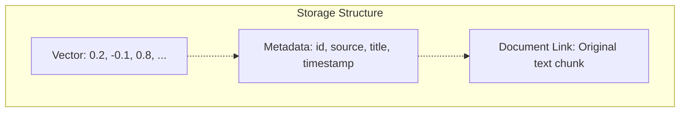

# Vector databases

In the [previous part](../6-rag/README.md) you learned about Retrieval-Augmented generation (RAG) for retrieving information for the LLM to use.

In this part you will learn:

- What are vector databases?
- How to upload documents to a vector database
- How to query a vector database for RAG

## What are vector databases

Traditional databases store information using either tables or document stores, and you can search based in the information that is in there. This is great when you know the information that you are searching for, but fall down when you need to search for something without knowing exactly what it is.

For example, if you wanted to find out more about the scene in Return of the Jedi set on the forest moon of Endor, but couldn't remember that it was a moon and searched for "forest planet" then a traditional database wouldn't return anything. Forest planet wouldn't match any data.

This doesn't work well with LLMs that are able to have a semantic understanding of what you are asking. For example, if you asked an LLM about the forest planet, it would give you the right information:

```output
User > What is the forest planet in Return of the Jedi?
Assistant > Ah, the forest planet in "Return of the Jedi," it is the forest moon of Endor. A lush, green world with dense forests and towering trees, home to the Ewoks it is. Small, brave creatures the Ewoks are, they helped the Rebel Alliance in the battle against the Empire. Remember, victory often comes from unexpected allies, yes, hmmm.
```

Vector databases are different to traditional databases. These are designed to work with LLMs. Instead of storing raw data, they store embeddings, which are numerical relationships between the tokens that would make up the data. These are stored in multi-dimensional vectors, with the directionality defined by similarity. If this sounds complicated, it is!

The important information here is - vector databases store similar information together, and you can then do a similarity search. For example, "moon" and "planet" are similar, so you can search for "planet" and get back "moon".

This makes them ideal for searching to get data to use with LLMs. You can ask the LLM a question, then perform RAG with a vector database to get information that is similar to what you asked for. For example, imagine an HR chatbot to get information on company policies, and you search for the "vacation policy", but the document is actually called "time off policy" and uses the term time off throughout instead of vacation. A traditional database query wouldn't find this, but a vector search would.

## How data is stored in a vector database

Vector databases take the documents you want to store, break them up into chunks, then indexes these chunks using vectors, storing metadata in the index linking back to the chunks, which in turn have metadata linking back to the original document. This allows you to search the index, then from there get back to the original content.



Chunk sizing varies, and depends on factors like the token limits of the models that create the embeddings, the content type, and the type of information you have. Smaller chunks are more precise but lose context, larger chunks have better context, but less focused results.

## Pinecone

Pinecone is a popular vector database that runs as a SaaS tool, or as a hosted service on your cloud. Pinecone indexes your data using internal embedding models, or using embeddings generated by the model of your choice, such as OpenAI. It also has a generous free tier.

You will be using Pinecone to store and index the scripts for some of the Star Wars movies to allow you to search for information without having to remember the exact details. You will create a helper project to upload the movie scripts. The search will be added to the MCP server as another tool.

### Create a free Pinecone account

1. Head to [Pinecone.io](https://pinecone.io), and sign up for a free account.

1. You will be provided an API key. Make sure you copy and save this as you will only see it once.

### Create the uploader tool

1. Create a new folder called `VectorDataloader`, and open this in your IDE.

1. In this folder, create a new .NET console project:

    ```bash Terminal
    dotnet new console
    ```

1. Add the Pinecone NuGet package to this project:

    ```bash
    dotnet add package Pinecone.Client 
    ```

1. The scripts are in the [movie-scripts.zip](./movie-scripts.zip) file. Download this file, and unzip it to the root of the `VectorDataloader` project. This should give you a folder in that project called `movie-scripts`.

1. Add an entry to the `VectorDataloader.csproj` file to copy the movie scripts to the output directory:

    ```xml
    <ItemGroup>
      <Content Include="movie-scripts\*.*">
        <CopyToOutputDirectory>Always</CopyToOutputDirectory>
      </Content> 
    </ItemGroup>
    ```

1. Delete all the code in the `Program.cs` file, and add a using directive for Pinecone:

    ```cs
    using Pinecone
    ```

1. Declare a couple of variables for the Pinecone client, and index name. A Pinecone database is referred to as an index.

    ```cs
    var pinecone = new PineconeClient("API_KEY");
    var indexName = "movie-scripts";
    ```

    Replace `API_KEY` with your Pinecone API key.

1. Add the following code to create the index:

    ```cs
    // Create the index if it does not exist
    var createIndexRequest = new CreateIndexForModelRequest
    {
        Name = indexName,
        Cloud = CreateIndexForModelRequestCloud.Aws,
        Region = "us-east-1",
        Embed = new CreateIndexForModelRequestEmbed
        {
            Model = "llama-text-embed-v2",
            FieldMap = new Dictionary<string, object?>()
            {
                { "text", "chunk_text" },
            }
        }
    };
    
    var index = await pinecone.CreateIndexForModelAsync(createIndexRequest);

    // Wait for the index to be ready
    while (!index.Status.Ready)
    {
        await Task.Delay(5000);
        index = await pinecone.DescribeIndexAsync(indexName);
    }
    ```

    Even though the call to `CreateIndexForModelAsync` returns, there is no guarantee that the index is ready, so you need to check the status and wait if it is not yet ready.

    > This code assumes your index does not exist. If you need to re-run this code, delete the index from your Pinecone console.

1. Next you need to upload the scripts. These need to be chunked, with each chunk uploaded and indexed. You will be using simple paragraph chunking, but there are many ways to do this and the best way depends on many factors including your data and the kind of application you are building.

    > You can learn more int the [Pinecone chunking strategies documentation](https://www.pinecone.io/learn/chunking-strategies/).

    Add the following code to load the scripts, chunk them, then upload them:

    ```cs
    // Get a client for the new index
    var indexClient = pinecone.Index(indexName);
    var recordNumber = 0;
    
    // Load the scripts into the index
    var scriptsPath = Path.Combine(AppContext.BaseDirectory, "movie-scripts");
    foreach (var scriptFile in Directory.GetFiles(scriptsPath, "*.md"))
    {
        var movieName = Path.GetFileNameWithoutExtension(scriptFile);
        Console.WriteLine($"Processing script: {movieName}");
    
        List<UpsertRecord> records = [];
    
        // Chunk the script content into manageable pieces
        var scriptContent = await File.ReadAllTextAsync(scriptFile);
        var chunks = scriptContent.Split(["\n\n"], StringSplitOptions.TrimEntries | StringSplitOptions.RemoveEmptyEntries);
    
        foreach (var chunk in chunks)
        {
            records.Add(new UpsertRecord
            {
                Id = $"rec{recordNumber++}",
                AdditionalProperties =
                {
                    ["chunk_text"] = chunk,
                    ["movie_name"] = movieName,
                },
            });
    
            // Pinecone has a limit of 96 records per upsert operation
            if (records.Count >= 96)
            {
                // Upsert the records to Pinecone
                await indexClient.UpsertRecordsAsync("Star Wars", records);
                records.Clear();
            }
        }
    
        // Upsert any remaining records
        await indexClient.UpsertRecordsAsync("Star Wars", records);
        Console.WriteLine($"\nFinished processing script: {movieName}");
    }
    ```

    This code gets an index client to use to upload records to the index. It then loads each script file, chunks them by paragraph, then uploads each chunk with an incrementing record number. Pinecone uploads are limited to 96 records at a time, so every time 96 chunks are ready, they are uploaded and the list is cleared.

1. Run the app. It will run, uploading any data.

    > If you get any issues and need to re-run it, you will need to delete the index from the Pinecone console.

1. Once run you will see the new index in the Pinecone console. You can then select it, and run queries against it.

### Configure the MPC server

Open the `StarWarsMCPServer` project.

1. Add a new entry to the `appsettings.json` file for the Pinecone API key:

    ```json
    {
        "Tools": {
            "TavilyApiKey": "",
            "StorageConnectionString": "",
            "PineconeApiKey": ""
        }
    }
    ```

1. Add a new property to the `ToolsOptions` class for this key:

    ```cs
    /// <summary>
    /// The Pinecone API key
    /// </summary>
    [Required]
    public string PineconeApiKey { get; set; } = string.Empty;
    ```

1. The scripts are in the [movie-scripts.zip](./movie-scripts.zip) file. Download this file, and unzip it to the root of the `StarWarsMCPServer` project. This should give you a folder in that project called `movie-scripts`.

1. Add an entry to the `StarWarsMCPServer.csproj` file to copy the movie scripts to the output directory:

    ```xml
    <ItemGroup>
      <Content Include="movie-scripts\*.*">
        <CopyToOutputDirectory>Always</CopyToOutputDirectory>
      </Content> 
    </ItemGroup>
    ```

### Add the tool

The tool you will be adding starts by creating the index if it doesn't exist, and uploads the scripts, using the built-in Pinecone models to create embeddings.

1. Install the Pinecone NuGet package:

    ```bash
    dotnet add package Pinecone.Client 
    ```

1. Add a using directive for this package to the top of the `StarWarsTools` class:

    ```cs
    using Pinecone;
    ```
