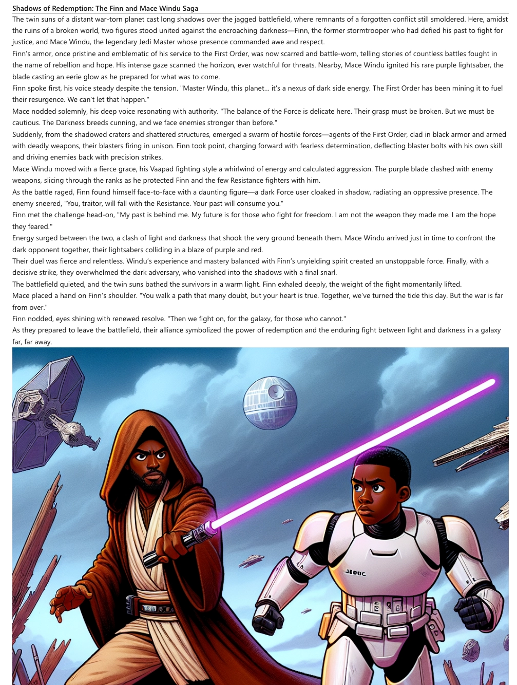

# Agents

In the [previous part](../8-multimodal/README.md) you learned about using multimodal AI, and add a tool that uses AI to generate images from a text prompt.

In this part you will learn:

- What are agents
- How to create a Semantic Kernel project
- How to orchestrate agents using Semantic Kernel

## What are AI agents

AI agents are AI powered code that can understand an instruction, reason over it, then act autonomously calling tools or other agents as required. This probably doesn't seem a new concept - you've actually built agents already in yor copilot. When you ask the copilot to do something, it will reason over the request, and call the relevant tools as it decides, essentially acting autonomously, rather than following explicit instructions.

You can see this in action in the copilot, by asking a question that requires multiple tools:

```output
User > Lando Calrissian ordered some figurines. Create an image for one of these based on their actions in the Star Wars movie scripts
Assistant > An image of Leia Organa, fearless leader of the Rebel Alliance, standing boldly on a battlefield, her expression determined and inspiring, with blaster in hand, leading troops into battle during the Galactic Civil War, I have created. See it here, you can:

 

Careful you must be, the path of the light side I encourage. The dark side, tempting it is and full of pain. Choose peace, you should.
```

This prompt will be reasoned over by the AI, and it will call the `StarWarsPurchaseTool` to get what figurines Lando purchased. It will then pick one character, and decide if it needs to call the `SearchStarWarsScriptsTool` or not. It probably won't as the AI model already has been trained on the Star Wars universe. It will then call the `GenerateStarWarsImageTool` tool to create the image.

### Components of an AI agent

Agents are typically single responsibility, doing one task and doing it well. The main components of an agent are:

- **An instruction** - Agents typically do one job, and have an instruction, essentially a system prompt, that defines the capabilities of the agent and how it should act
- **An LLM** - Agents use an LLM to decide what to do with the prompt provided
- **Tools** - Agents can interact with one or more tools to achieve the task they are built for
- **A description** - The description of an agent helps when you are using a framework that orchestrates multiple agents. The description is used by the orchestrator to decide what agents to call to perform a task.

### Triggering AI agents

We think of AI agents as autonomous, but they are still controlled by something. In the case of a copilot, the agent is triggered by a chat interface, but any other trigger would work.

You can think of AI agents a bit like event-driven serverless functions, such as Azure Functions. Something needs to trigger the agent, such as a web hook, a chat request, a timer, detection of an email, anything you can think of.

### AI agent capabilities

AI agents are only as powerful as the tools you build to interact with them. If you call OpenAI to generate some code, it won't be able to change the code on your machine. Instead you would need a tool to take the results of the interaction with the LLM and have that interact with the code you have locally. This is how applications like GitHub copilot work, they use the LLM to reason over your request and code, then run tools locally to make code updates.

### AI agent orchestration

When building an agentic AI system, ideally you want a lot of small, specific AI agents that do one job and do it well. You then have some kind of orchestrator that decides what agents to call and in what order. This orchestrator usually has some kind of supervisor agent that decides what to call, and a defined set of orchestration patterns between agents to ensure agents are called in the right order where necessary.

Agents can use handoff orchestration to transfer control from one agent to another, handing off the responsibility of generating a response as necessary. In your app you can define the handoff rules, specifying what conditions are needed for an agent to handoff to another agent in natural language. Agents can hand off to other agents, or to humans for human-in-the-loop systems, for example waiting for confirmation from a human to proceed.

## Semantic Kernel

[Semantic Kernel](https://learn.microsoft.com/semantic-kernel/) is Microsoft's AI application development framework, available for C#, Python, and Java. It allows you to integrate any AI model, add tool support via plugins, add basic application components like telemetry, connect other components, and orchestrate agents.

When Semantic Kernel first came out, it was a pretty powerful framework, especially for planning actions based off prompts, using different LLMs with the same abstractions, and calling plugins, the Semantic Kernel name for tools. At the moment such basic features are not really useful. By using `Microsoft.Extensions.AI`, it's easy to swap different LLMs in and out. By using MCP it's easy to add tools, and modern LLMs are great at planning.

This means for applications like our copilot, frameworks like Semantic Kernel can be overkill. Where they are useful however, is when orchestrating agents.

## Build an agentic app

You will be using Semantic Kernel to create an agentic app that creates stories for customers based off their purchases. The app will look up purchases from a customer, research the characters, create a story using these characters, then generate an cover image for the story. This agentic app will be triggered by text, asking for a purchaser to create a story for, but in the future could be triggered by a new purchase using an Azure Function that monitors for new rows in our database.

### Create the project

In this step, you will create the basic scaffold of this project, adding NuGet packages and loading configuration.

1. Create a new folder for your project called `StarWarsAgentCopilot`. Open this folder in your IDE.

1. Inside this new folder, create a new .NET console project:

    ```bash
    dotnet new console
    ```

1. Install the Semantic Kernel NuGet packages, along with some Microsoft Extensions packages.

    ```bash
    dotnet add package Microsoft.SemanticKernel 
    dotnet add package Microsoft.Extensions.Logging
    dotnet add package Microsoft.Extensions.Logging.Console
    dotnet add package Microsoft.Extensions.Configuration.Json
    ```

1. You will need the same configuration as your original copilot, so copy the `appsettings.json`, `LLMOptions.cs`, and `MCPServerOptions.cs` files over from your `StarWarsCopilot` project folder to this folder.

1. Update the namespace for both the `LLMOptions` and `MCPServerOptions` classes to match the project name:

    ```cs
    namespace StarWarsAgentCopilot;
    ```

1. You need to make sure the `appsettings.json` file is copied to the output folder when your project is built, so open the `StarWarsAgentCopilot.csproj` file and add the following inside the `<Project>` section:

    ```xml
    <ItemGroup>
      <None Update="appsettings.json">
        <CopyToOutputDirectory>PreserveNewest</CopyToOutputDirectory>
      </None>
    </ItemGroup>
    ```

1. Delete all the code from your `Program.cs` file, and add the following code to load the application settings:

    ```cs
    using Microsoft.Extensions.Configuration;
    using Microsoft.Extensions.Logging;
    using Microsoft.Extensions.DependencyInjection;

    using StarWarsAgentCopilot;

    // Build the configuration
    var configuration = new ConfigurationBuilder()
        .SetBasePath(AppContext.BaseDirectory)
        .AddJsonFile("appsettings.json", optional: false, reloadOnChange: true)
        .Build();
    
    // Get the LLM configuration
    var llmOptions = configuration.GetSection(LLMOptions.SectionName)
                                  .Get<LLMOptions>();
    
    if (llmOptions == null)
    {
        throw new InvalidOperationException("LLM configuration is missing. Please check your appsettings.json file.");
    }
    
    // Get the MCP Server configuration
    var mcpServerOptions = configuration.GetSection(MCPServerOptions.SectionName)
                                        .Get<MCPServerOptions>();
    
    if (mcpServerOptions == null)
    {
        throw new InvalidOperationException("MCP Server configuration is missing. Please check your appsettings.json file.");
    }
    ```

### Add Semantic Kernel

You now have the basic scaffolding of an app. The next step is to add Semantic Kernel.

1. Add a using directive for Semantic Kernel to the top of your `Program.cs` file:

    ```cs
    using Microsoft.SemanticKernel;
    ```

1. At the bottom of this file, create a kernel builder:

    ```cs
    Console.WriteLine("Creating kernel...");
    var builder = Kernel.CreateBuilder();
    ```

    Semantic Kernel is based around a **kernel**, a dependency injection container that manages all of the services and plugins. The kernel acts as a planner and orchestrator as needed. Like a lot of Microsoft components, the kernel is created using the builder pattern.

1. Add logging to the kernel builder:

    ```cs
    builder.Services.AddLogging(services =>
    {
        services.AddConsole().SetMinimumLevel(LogLevel.Trace);
    });
    ```

    This will log everything at a trace level, the same as we had in our copilot. This allows you to see the inner workings of your app.

1. Add an LLM to the builder using an Azure OpenAI service:

    ```cs
    builder.AddAzureOpenAIChatClient(llmOptions.ModelId,
                                     llmOptions.Endpoint,
                                     llmOptions.ApiKey);
    ```

1. Finally build the kernel:

    ```cs
    var kernel = builder.Build();
    ```

### Test the Semantic Kernel app

As a sanity check, you can test the kernel to make sure the basics are configured.

1. Add the following code to the end of your `Program.cs` file to test the kernel:

    ```cs
    var response = await kernel.InvokePromptAsync("Hello world!");
    Console.WriteLine($"Response: {response}");
    ```

1. Run the app:

    ```bash
    dotnet run
    ```

    You will see a hello world style response in your terminal, along with a trace log:

    ```output
    Response: Hello! How can I assist you today?
    ```

1. Delete these 2 new lines of code as they were just needed for a quick test.

### Add tools

Semantic Kernel has the concept of **Plugins** to provide function calling, or tool calling. Plugins are more than simple tools though, as Semantic Kernel can use dependency injection to manage and compose local tools.

Seeing as we already have tools in our MCP server, we can convert these tools to plugins used by the kernel.

1. Add the MCP NuGet package to the project:

    ```bash
    dotnet add package ModelContextProtocol --prerelease
    ```

1. The functionality to convert from an MCP tool to a plugin is still very early pre-release, so add the following to the top of the `Program.cs` file to disable early access errors:

    ```cs
    #pragma warning disable SKEXP0001
    #pragma warning disable SKEXP0110
    ```

1. Add the following using directive to the top of the `Program.cs` file:

    ```cs
    using ModelContextProtocol.Client;
    ```

1. Just above the line that builds the kernel, create an MCP client and load the tools:

    ```cs
    // Create an MCP client
    await using var mcpClient = await McpClientFactory.CreateAsync(new StdioClientTransport(new()
    {
        Name = mcpServerOptions.Name,
        Command = mcpServerOptions.Command,
        Arguments = mcpServerOptions.Arguments,
    }));

    // Retrieve the list of tools available on the MCP server
    var tools = await mcpClient.ListToolsAsync();
    ```

1. Add the tools to the builder by converting them to Semantic Kernel functions:

    ```cs
    builder.Plugins.AddFromFunctions("MCP", tools.Select(t => t.AsKernelFunction()));
    ```

    Now when the kernel is built, it will have access to all the tools.

### Test the tools

By default Semantic Kernel won't call tools. When you use the kernel, you can define the tool calling behavior, for example use any tool it decides is relevant, use a specific tool, or use no tools. To test the tools, you can turn on automatic function calling and ask a question that a tool would needed to answer.

1. Add the following code to the bottom of the `Program.cs` file:

    ```cs
    PromptExecutionSettings executionSettings = new()
    {
        FunctionChoiceBehavior = FunctionChoiceBehavior.Auto()
    };
    
    var response = await kernel.InvokePromptAsync("What figurines did Ben Smith purchase?", new KernelArguments(executionSettings));
    Console.WriteLine($"Response: {response}");
    ```

1. Run the code. This will launch the MCP server, and use the `StarWarsPurchaseTool` to list the figurines Ben Smith purchased.

    ```output
    Response: Ben Smith purchased the following figurines:
    1. Chewbacca - A mighty Wookiee warrior from Kashyyyk, known for his strength, bravery, and skills as a co-pilot of the Millennium Falcon.
    2. Obi-Wan Kenobi - A noble Jedi Master and mentor to Anakin Skywalker and Luke Skywalker, known for his diplomacy, patience, and wisdom.
    3. Finn - Originally a stormtrooper who defected from the First Order to become a courageous Resistance fighter, known for bravery and a strong sense of justice.
    ```

1. Delete the `PromptExecutionSettings` and code to invoke the kernel once you are done.

## Add agents to the app

For our app, we need a number of agents:

- **Supervisor agent** - This agent will be the main point of interaction. It will take the name of a customer, and use other agents to get the figurines that the customer purchased, research those characters, generate a story image, and create the story.
- **Purchase details agent** - This agent will look up the figurines purchased by the customer. This will use the `StarWarsPurchaseTool`.
- **Wookiepedia research agent** - This agent will look up details on the characters of the purchased figurines on Wookiepedia. This will use the `WookiepediaTool`.
- **Image generation agent** - This agent will generate an image for the story. This will use the `GenerateStarWarsImageTool`.

The supervisor agent will be configured to hand off to the other agents as needed, then collate the results and generate a story.

### Create the agents in your app

1. To use the Semantic Kernel agent framework, you need to install a couple of additional NuGet packages:

    ```bash
    dotnet add package Microsoft.SemanticKernel.Agents.Core
    dotnet add package Microsoft.SemanticKernel.Agents.Orchestration --prerelease
    dotnet add package Microsoft.SemanticKernel.Agents.Runtime.InProcess --prerelease
    ```

1. Add the following Semantic Kernel agent orchestration using directives at the top of the `Program.cs` file:

    ```cs
    using Microsoft.SemanticKernel.Agents;
    using Microsoft.SemanticKernel.Agents.Orchestration.Handoff;
    using Microsoft.SemanticKernel.Agents.Runtime.InProcess;
    ```

1. Create the supervisor agent by adding the following code to the bottom of the `Program.cs` file, after the kernel has been built:

    ```cs
    ChatCompletionAgent supervisorAgent =
        new()
        {
            Name = "SupervisorAgent",
            Description = "This agent supervises the creation of a custom Star Wars story based on the figurines purchased by the customer.",
            Instructions =
                """
                You are an agent designed to supervise the creation of a custom Star Wars story for a store customer who has purchased figurines from our store.
    
                When given a customer name, you will retrieve the list of figurines they purchased and use that information to create a personalized story with artwork.
                To research the characters and lore of the purchased figurines, and to generate the story, you can use other agents as necessary.
    
                When you have generated the story and image you will return the text of the story. It is important that you generate an image URL that is relevant to the story, as this will be used to create a visual representation of the story.
    
                The story should:
                - Be at least 2000 words long
                - Include detail, dialogue, and action to make the story engaging
                - Have a beginning, middle, and end, and be written in a style that is consistent with the Star Wars universe
    
                Return the result as a JSON object in the following format:
                {
                    "title": "A Star Wars Adventure",
                    "story": "Once upon a time in a galaxy far, far away...",
                    "imageUrl": "https://example.com/image.png"
                }
                """,
            Kernel = kernel,
            Arguments = new KernelArguments(new PromptExecutionSettings { FunctionChoiceBehavior = FunctionChoiceBehavior.None() })
        };
    ```

    This code creates a `ChatCompletionAgent`, an agent that processes chat completions. This agent has a name and description, along with an instruction. This instruction is essentially a system prompt for the agent. It details that the agent should take a customer name, look up the figurines they have purchased, retrieve information about the characters, generate an image, generate a story, then return JSON with the title and body of the story, along with the URL of the generated image.

    This agent is configured to use the current kernel, and not to call any tools itself. This way the agent has to call other agents to achieve the task at hand.

1. Create an agent to retrieve the figurines purchased by the customer:

    ```cs
    var purchaseExecutionSettings = new PromptExecutionSettings
    {
        FunctionChoiceBehavior = FunctionChoiceBehavior.Required(kernel.Plugins.First(p => p.Name == "MCP").Where(f => f.Name == "StarWarsPurchaseTool"))
    };

    ChatCompletionAgent purchaseDetailsAgent =
        new()
        {
            Name = "PurchaseDetailsAgent",
            Description = "This agent retrieves the purchase details for a specific customer.",
            Instructions =
                """
                You are an agent designed to retrieve the purchase details for a specific customer.
    
                When given a customer name, you will retrieve the list of figurines they purchased.
                """,
            Kernel = kernel,
            Arguments = new KernelArguments(purchaseExecutionSettings)
        };
    ```

    This code defines some prompt execution settings. This sets that the agent is required to use the `StarWarsPurchaseTool`.

    This agent is configured to retrieve a list of figurines for a customer using the prompt execution settings to ensure the tool is used.

1. Create an agent to research the characters using Wookiepedia:

    ```cs
    var wookiepediaExecutionSettings = new PromptExecutionSettings
    {
        FunctionChoiceBehavior = FunctionChoiceBehavior.Required(kernel.Plugins.First(p => p.Name == "MCP").Where(f => f.Name == "WookiepediaTool"))
    };
    
    ChatCompletionAgent wookiepediaResearchAgent =
        new()
        {
            Name = "WookiepediaResearchAgent",
            Description = "This agent retrieves information from Wookiepedia about Star Wars characters.",
            Instructions =
                """
                You are an agent designed to retrieve information from Wookiepedia about Star Wars characters.
    
                When given a character name you will search Wookiepedia and return relevant information.
                """,
            Kernel = kernel,
            Arguments = new KernelArguments(wookiepediaExecutionSettings)
        };
    ```

    Again this is configured to use a tool, in this case the `WookiepediaTool`. It takes a character and returns details about that character. This agent will be called multiple times, once per character that is retrieved from the purchase details agent.

1. Create an agent to generate the story image:

    ```cs
    var imageGenerationExecutionSettings = new PromptExecutionSettings
    {
        FunctionChoiceBehavior = FunctionChoiceBehavior.Required(kernel.Plugins.First(p => p.Name == "MCP").Where(f => f.Name == "GenerateStarWarsImageTool"))
    };
    
    ChatCompletionAgent imageGenerationAgent = 
        new()
        {
            Name = "ImageGenerationAgent",
            Description = "This agent generates an image based on a set of figurines of Star Wars characters.",
            Instructions =
                """
                You are an agent designed to generate an image based on a set of Star Wars characters.
    
                When given a set of figurines of Star Wars characters, you will create an image that represents them.
                You will return the URL of the generated image as JSON in the format:
                {
                    "imageUrl": "https://example.com/image.png"
                }
    
                If a tool responds asking you to call it again, follow the instructions and make the call again.
                """,
            Kernel = kernel,
            Arguments = new KernelArguments(imageGenerationExecutionSettings)
        };
    ```

    Once again, this is configured to always use a tool, the `GenerateStarWarsImageTool`. The response is JSON with a single property, `imageUrl`. The instruction also encourages the agent to retry calling the tool if necessary, in the same was as you did in the copilot.

### Define the handoffs

Handoffs don't happen automatically. Instead you have to define which agents can handoff to which other agents, and describe in natural language how this handoff should happen.

1. Add the following code to define the handoff rules:

    ```cs
    var handoffs = OrchestrationHandoffs
        .StartWith(supervisorAgent)
        .Add(purchaseDetailsAgent)
        .Add(wookiepediaResearchAgent)
        .Add(imageGenerationAgent)
        .Add(supervisorAgent, purchaseDetailsAgent, "Transfer to this agent to get details of the purchased figurines")
        .Add(supervisorAgent, wookiepediaResearchAgent, "Transfer to this agent to research the characters and lore of the purchased figurines")
        .Add(supervisorAgent, imageGenerationAgent, "Transfer to this agent to generate an image based on the purchased figurines");
    ```

    This creates a handoff orchestrator that starts with the supervisor agent, adding the purchase details, Wookiepedia research, and image generation agent as handoff targets. Finally it defines that only the supervisor agent can handoff to the other agents, with details on when this should happen.

1. Create an orchestrator using this handoff:

    ```cs
    var orchestration = new HandoffOrchestration(
        handoffs,
        supervisorAgent,
        purchaseDetailsAgent,
        wookiepediaResearchAgent,
        imageGenerationAgent
    );
    ```

    This orchestration is now ready to be invoked.

### Start an agent runtime

When Semantic Kernel runs, it needs an agent thread runtime running. This runtime calls the agents and waits on the results.

1. Create and start the runtime:

    ```cs
    var runtime = new InProcessRuntime();
    await runtime.StartAsync();
    ```

1. Ask the user which customer they want to generate a story for:

    ```cs
    Console.WriteLine("Which customer would you like to create a story for? (e.g., 'Ben Smith')");
    var customerName = Console.ReadLine();
    ```

1. Start the agent orchestration:

    ```cs
    var result = await orchestration.InvokeAsync(customerName!, runtime);
    ```

    This will start the agent thread running in the background. This call will return once the agent has started.

1. Wait for the agent thread to finish:

    ```cs
    string output = await result.GetValueAsync(TimeSpan.FromSeconds(300));
    ```

    This will wait for the orchestration to finish, timing out after 5 minutes if it hasn't completed by that point.

1. Run the code. It will ask for a customer, and will generate a story.

    ```output
    Which customer would you like to create a story for? (e.g., 'Ben Smith')
    Leia Parker
    ```

    This will run the agents and generate a story and image

    ```json
    {
    "role": "assistant",
    "contents": [
        {
        "$type": "text",
        "text": "{\n  \"title\": \"The Alliance of Light and Courage\",\n  \"story\": \"In the galaxy far, far away, a new saga unfolds in the shadow of the rising conflict between the remnants of darkness and the sparks of hope. On the war-torn world of Serenno, the legendary Jedi Master Mace Windu, renowned for his purple lightsaber and steadfast dedication to the Jedi Order, has sensed a disturbance in the Force unlike any before.\\n\\nMeanwhile, Finn, a former stormtrooper of the First Order who had bravely defected to join the Resistance, finds himself embroiled in a mission with potentially galaxy-saving consequences. Once designated FN-2187, this courageous young human male harbors a fierce sense of justice and a desire to atone for his past—a trait that leads him to cross paths with Master Windu.\\n\\nThe story begins as Mace Windu, cloaked in his traditional brown Jedi robes, lands on Serenno to investigate reports of a secretive force amassing power that threatens to engulf the galaxy in chaos. Finn, clad in a mix of his old stormtrooper armor adapted for resistance missions, carries a blaster rifle tightly, his heart pounding with anticipation.\\n\\nThe two heroes meet amidst a blazing sunset overlooking the remnants of a battlefield scattered with wreckage from recent skirmishes. Windu's stern, calm demeanor contrasts with Finn's youthful determination.\\n\\n\\\"We do not have much time,\\\" Windu intones, gripping his purple lightsaber. \\\"The darkness feeds on fear, and the longer we wait, the stronger it grows.\\\"\\n\\nFinn nods. \\\"Then let's make sure it doesn't have that chance. I know the instincts of those who serve the darkness—I was one of them.\\\"\\n\\nTogether, they strategize to infiltrate the stronghold of the shadowy faction, believed to be manipulating rogue Force-users desperate for power.\\n\\nTheir journey is fraught with peril—ambushes from remnants of First Order loyalists, traps set by cunning mercenaries, and the oppressive weight of the dark side trying to sway Finn back into its fold. Yet, through every trial, the bond between the wise Jedi and the defiant fighter strengthens.\\n\\nIn the climactic battle, surrounded by the ruins of an ancient temple, Windu's mastery of the Vaapad combat style dazzles as he duels with a dark Force-wielder cloaked in shadows. Finn uses his blaster with precision, protecting Windu from unexpected attacks and proving that courage can shine even without the Force.\\n\\n\\\"You fight not just with weapons,\\\" Windu observes, \\\"but with heart. That is your true strength.\\\"\\n\\nWith the villains defeated and hope rekindled, the two stand side by side, looking towards the stars. The galaxy still faces countless challenges, but this alliance of light and courage serves as a beacon for all who yearn for peace.\\n\\nAs the twin suns of Serenno set, a new chapter begins—one where legends rise, friendships are forged, and the Force binds those who fight for the greater good.\",\n  \"imageUrl\": \"https://dalleproduse.blob.core.windows.net/private/images/...\"\n}"
        }
    ],
    "messageId": "chatcmpl-C3CRQ7rEo9gO57I7DhG0Ga44SDw7o"
    }
    ```

    If you get an error with the text "An assistant message with 'tool_calls' must be followed by tool messages responding to each 'tool_call_id'. The following tool_call_ids did not have response messages: call_8IAs38o7O5yOmeaYe8fhjb2i", then re-run the agent. LLMs are unreliable, so can make mistakes when orchestrating multiple agents and tools.

    > The customers are:
    > Luke Johnson
    > Leia Parker"
    > Han Richards
    > Ben Smith
    > Yoda Masterson
    > Rey Fisher
    > Anakin Skywalker
    > Padmé Amidala
    > Lando Calrissian
    > Obi Wan

### Save the results

The results come back as JSON with a story, a title for the story, and the URL of the generated image.

1. Add some code to save the story and image:

    ```cs
    var storyResult = System.Text.Json.JsonSerializer.Deserialize<StoryResult>(
            output,
            new System.Text.Json.JsonSerializerOptions { PropertyNameCaseInsensitive = true }
        );
    
    var imageUri = new Uri(storyResult!.ImageUrl);
    
    var outputDirectory = Path.Combine(Directory.GetCurrentDirectory(), "output");
    
    // Create the output directory if it doesn't exist
    if (!Directory.Exists(outputDirectory))
    {
        Directory.CreateDirectory(outputDirectory);
    }
    
    // Download the image
    using var httpClient = new HttpClient();
    var imageBytes = await httpClient.GetByteArrayAsync(imageUri);
    var imageFilePath = Path.Combine(outputDirectory, $"{Guid.NewGuid()}{Path.GetExtension(imageUri.LocalPath)}");
    await File.WriteAllBytesAsync(imageFilePath, imageBytes);
    
    // Write the story to a file in the output directory
    string filePath = Path.Combine(outputDirectory, $"{storyResult.Title}.md");
    File.WriteAllText(filePath, $"# {storyResult.Title}\n\n{storyResult.Story}\n\n})\n");
    
    // Write that the file was created to the console
    Console.WriteLine($"Story '{storyResult.Title}' created successfully with image at {imageFilePath} and saved to {storyResult.Title}.md");
    
    record StoryResult(string Title, string Story, string ImageUrl);
    ```

    This code defines a record type for the response, then deserializes the response to an instance of that record. It then downloads the image to an `output` folder in the current directory, and writes the story as markdown to a file in that same directory.

1. Run the code. This will generate the story and image in the `output` directory. You can then open the generated markdown and preview it to see the story and image.

    

## Summary

In this workshop, you have:

- Learned about copilots
- Created a simple chat-based LLM
- Learned about chat history, and its importance for stateless LLMs
- Used different LLMs
- Learned about SLMs, running LLMs locally
- Learned about tool calling
- Learned about MCP
- Created an MCP server and client in your copilot
- Learned about RAG
- Used RAG to load data from a database
- Learned about vector databases
- Retrieved data from a vector database
- Learned about multimodal AI
- Used AI to generate images from text
- Learned about agents
- Built a multi-agent system using Semantic Kernel and tools
